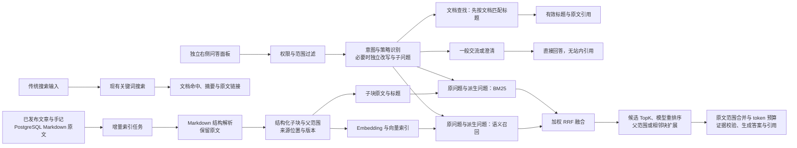

# RAG 接入设计

> 状态：右侧问答、后台 RAG 模块及真实检索链路已接入。同篇证据丢失、过早澄清、命中摘要后拒答和完整公式超限已修复，详见 [定向修复记录](Test/benchmark/fixes_20260929.md)。最终证据动态 TopK 已接入，默认范围 2–12，后台可开关与调整上下限；按问题策略、相对排名分差、子查询证据与 token 预算选择数量。聊天初始顺序为 GPT、Grok、Gemini、OpenCode Go、官方 DeepSeek；向量与重排序保持 BGE。更新日期：2026-09-29。自动扩大召回或二次检索、各内容类型独立后台参数和持久化对话尚未完成；答案完整性、通道延迟和最优参数仍需改进，后台新增控件视觉与保存交互尚未验证。

动态 TopK 的配置、真实入口对照、原三道论文问题复查及环境恢复见 [实现与定向验证记录](Test/benchmark/dynamic_topk_20260929.md)。定向检查不代替全量公开成绩或答案准确性评分。

## 1. 目标与现状

目标是让读者用自然语言查询站内**已发布**的文章和手记，并获得能回到原文位置的引用。问候、一般交流可以自然回应，站内事实必须来自当前有效来源。首期索引只处理本站内容；未来若接入 PDF、Word 等资料，应先转换为可检查的 Markdown 与资源清单，再进入同一索引链路。

当前项目中，文章和手记共用 `moment`：`content` 是 PostgreSQL 中的 Markdown 原文，`ext_info.contentKind` 区分 `article` 与 `note`。前端按 Markdown 渲染；后台提供 `.md` 导出，其中结构化导出为 `content.md` 加 `meta.json`，扁平导出使用项目自定义的 `---meta` / `---content` 格式。导出包含未发布内容，因此**在线 RAG 不直接扫描导出目录**。数据库是唯一内容来源，`.md` 是可移植的导出物。历史 `unclassified` 内容需要先确认归属，不能默默当作文章或手记索引。

现有站内搜索使用 PostgreSQL `to_tsvector('simple')`、`plainto_tsquery('simple')` 和 `ILIKE`，并过滤未发布或删除的记录；它不是 BM25，也不是向量检索。当前部署是 `postgres:17-alpine`，不能假设已经安装 `pgvector`。本次新增独立 embedding 适配器，未修改普通搜索。

## 2. 总体链路



当前实现复用现有 Go 服务与 PostgreSQL，将归一化向量保存在 `DOUBLE PRECISION[]`，以点积执行精确余弦检索，不需要安装扩展或部署独立 WeKnora 服务。查询需要扫描当前索引，语料增大后的延迟尚未测量；只有实测需要优化时才评估 `pgvector` 和 HNSW，并对比召回差异。[pgvector 官方文档](https://github.com/pgvector/pgvector/blob/master/README.md)作为后续优化依据。

### 搜索与提问双入口

传统搜索和 RAG 提问是两个独立能力。搜索负责“找到哪些文章或手记”，提问负责“根据已检索证据组织回答”；不能因为接入 RAG 就把普通搜索改成每次输入都调用模型，也不能把普通搜索结果伪装成生成答案。

| 入口     | 触发方式                                   | 返回内容                                               | 模型依赖                               |
| -------- | ------------------------------------------ | ------------------------------------------------------ | -------------------------------------- |
| 传统搜索 | 保留现有搜索框、上下文搜索和回车／输入防抖 | 文章或手记命中、摘要片段、内容类型、日期和原文链接     | 无，搜索服务不可用时按现有错误状态处理 |
| 提问     | 用户明确进入“提问”入口并提交问题           | 回答、引用列表、证据片段、原文定位、回答状态和索引版本 | 需要检索、可选重排和生成模型           |

当前采用两个视觉和行为都分开的入口：

- **顶部搜索**继续作为普通搜索入口。它属于书架的导航功能，输入后返回文章或手记命中，不展示生成式回答。
- **右侧问答入口**独立放在页面右边缘，点击后展开右侧问答面板；移动端面板占满可用宽度。它不改变现有书架导航，也不进入独立页面。

问答入口使用文字和对话图标表达，不与搜索或“翻开此页”混用。面板沿用现有字体、颜色和纸张风格；打开时聚焦问题输入框，关闭时焦点返回入口，支持 Escape 和键盘操作。

| 场景           | 顶部搜索                   | 桌面问答入口                           |
| -------------- | -------------------------- | -------------------------------------- |
| 桌面端默认位置 | 页面上方或现有导航区       | 页面右边缘的独立“问答”入口             |
| 点击后的行为   | 聚焦搜索框或打开搜索模态框 | 从右侧展开面板，保留当前页面作为背景   |
| 提交后的结果   | 文档列表、摘要和原文链接   | 回答、引用、证据片段和“查看原文”       |
| 服务不可用时   | 按传统搜索错误状态处理     | 明确显示“问答暂不可用”，提供“改用搜索” |
| 移动端替代     | 顶部搜索按钮               | 页面边缘的问答按钮，展开后适配手机宽度 |

面板不依赖动画才能理解或操作，减少动态效果的系统偏好必须生效。问答面板打开后保留当前页面背景；切换到搜索时关闭问答面板，避免两个弹层重叠。

前端打开面板时查询服务状态，启用且聊天配置完整即可发送；`indexReady` 单独表示站内检索索引是否就绪，空索引不阻断一般交流。输入不触发问答请求；Enter 发送，Shift+Enter 换行，输入法组词期间的 Enter 不发送。用户气泡靠右，助手气泡靠左，完整保留当前页面的历次问答。关闭面板取消未完成请求并标记中止，保留已有记录、草稿与匿名会话 UUID；重新打开仍保留，刷新后清空。服务不可用时显示真实状态、禁用发送，并提供重新检查和站内搜索入口，不展示虚构回答或引用。

提问只在用户提交时触发请求，发布状态与内容类型由服务端校验。当前接口使用项目统一响应封装，接口路径如下；日期过滤尚未实现：

```text
GET  /api/v2/public/search?q=<query>&limit=<n>
GET  /api/v2/public/rag/status
POST /api/v2/public/ask
{
  "question": "...",
  "contentKind": "article",
  "sessionId": "客户端当前页面内存中的 UUID",
  "history": [
    { "role": "user", "content": "上一轮问题" },
    { "role": "assistant", "content": "上一轮回答" }
  ]
}
```

`contentKind` 可选，省略时同时检索公开文章和手记；仅接受 `article` 或 `note`。`sessionId` 可选，省略时服务端生成单次会话 UUID；侧边栏会在同一页面使用稳定 UUID。`history` 可选，默认传入最近五轮成功回答、十条交替的 user／assistant 消息；`RAG_HISTORY_MAX_ROUNDS` 可配置 1–20 轮，`RAG_HISTORY_MAX_CHARACTERS` 可配置 1000–20000 个 Unicode 字符，默认 20000。状态接口返回生效策略，前端按该策略保留近期完整问答对。单条问题最多 1000 字符，回答最多 6000 字符。服务端校验角色、顺序与长度，不接受 system 角色。页面记录全部保留，模型只接收预算内的近期历史。当前不写数据库、localStorage 或服务端会话存储。

服务端进一步按 `historyMaxTokens` 截取近期完整问答对，默认 3000 个 `cl100k_base` 参考 token；设为零时不向模型提供历史。该预算独立于页面展示记录。参考编码便于可重复比较，不代表 BGE 或各聊天模型的原生 tokenizer 与计费数量。

RAG 失败时必须返回明确状态，并提供“改用搜索”的动作；不能把普通搜索命中伪装成生成答案。站内事实问题没有足够证据时显示“站内现有内容未找到依据”，同时可给出相关搜索入口；问候与一般交流不因此拒答。超时、模型不可用和索引暂不可用分别记录，便于区分内容问题与基础设施问题。

### 索引同步与边界

1. 数据库触发器在来源事务内持久化索引任务；工作进程使用租约领取，每个来源最多尝试五次，并每分钟对账。取消发布或删除时在同一事务内排除来源并清理派生块，不依赖进程内事件。每批最多 16 块，发送 embedding 请求前用一次来源状态查询检查发布状态、指纹和租约；这项循环内 SQL 用于停止撤回后的后续发送，不逐块查询。
2. 发布后读取数据库当前版本，解析并构建新块，完成后原子切换可检索版本。旧任务落后于新内容时丢弃其结果。取消发布或删除时立即使旧索引不可检索，再异步清理派生数据。
3. 查询时再次校验来源仍为已发布且未删除；即使索引同步延迟，也不得把草稿、已撤回内容或旧版本片段交给生成模型。
4. 来源指纹覆盖原文、标题、摘要、类型和短链接；原文中的资源引用变化也改变指纹。索引配置指纹覆盖分块器版本、分块参数、embedding 地址、模型、维度和手动版本，不包含密钥。当前逐篇原子替换旧块，更换配置后只查询新版本已就绪的文档；尚未实现全站并行索引、版本快照与回滚。
5. 首次上线做一次受控全量回填，以后增量更新；导出的结构化和扁平 `.md` 不得同时回灌，以免一篇内容被索引两次。

当前证据包含来源 ID、类型、来源指纹、块 ID、块类型、标题路径、原文偏移、页面 URL、索引版本与实时日期。字符偏移按 Unicode 码点计数，`start` 包含起点、`end` 不包含终点。标题路径与重复表头放在 `contextHeader`，`content` 保持原文。子块详情补充父范围、前后块标识和参考 token 数。扩展证据保留检索子块的锚点 ID，正文及偏移改为当前原文的完整扩展范围，并再次校验来源。URL 由服务端根据现有阅读页路由生成；尚不支持段落锚点或图片资源映射。

## 3. Markdown、表格与多模态处理

当前用 Goldmark 识别真实 Markdown 标题，结合递归分隔与保护区域处理代码围栏、GFM 表格、链接、图片替代文字和 `$$` 公式。原文不被清洗或改写，大段代码与表格只在完整行之间拆分，过长的单行或公式记录为索引失败。以下表格为后续完整内容处理要求；HTML／自定义组件规范化、OCR、图片识别、PDF／Word 转换尚未实现。不能把原文保留等同于理解图片或公式。

| 内容                   | 索引表示                                                                               | 引用与质量要求                                                                                                               |
| ---------------------- | -------------------------------------------------------------------------------------- | ---------------------------------------------------------------------------------------------------------------------------- |
| 普通正文               | 原文段落加文章标题、标题路径；保留列表层级与链接文字                                   | 回到原文标题或段落，避免只给文章首页                                                                                         |
| Markdown / HTML 表格   | 表名、邻近说明、列名和若干完整数据行组成一个表格块；大表按行组拆分，每块重复列名和单位 | 保留行列标识与原始数值；跨行／跨列 HTML 表格先规范化并人工抽样校验，不能用无结构的单行文本代替                               |
| 普通图片、相册图片     | 作者填写的替代文字、图注和相邻正文优先；必要时另建图片说明块，并与父段落关联           | 说明模型生成的描述只能标记为机器推断；没有图片或无有效说明时不编造图像内容                                                   |
| 文档中的截图、含字图片 | OCR 文本作为独立资源块，带图片 ID、所属段落、识别置信度；去除重复水印、页眉页脚        | 代码、数字、按钮文字和截图表格须抽样复核；低置信度内容不作为唯一证据。若问题依赖布局或颜色，后续需视觉模型核验，OCR 本身不够 |
| 公式                   | 原始 LaTeX／Unicode 表达式作为不可拆分单元；可另存经审核的文字解释                     | 精确符号、变量与上下文同时引用；图片公式需要专门识别和人工复核，不能把 OCR 猜测当原式                                        |
| 代码块                 | 保留语言、完整代码块与邻近解释；超长代码按语义段落拆分                                 | 标识符、版本号和报错文本需要关键词通道，不能只依赖语义向量                                                                   |
| HTML 与自定义组件      | 解析可见文本及有意义属性；排除脚本、样式、装饰性内容                                   | 无法可靠还原的组件先记录为不可索引，不静默丢失关键信息                                                                       |
| 未来 PDF / Word        | 原文件先转为规范 Markdown、资源清单及页码／区域映射，再执行上述步骤                    | 保留原文件与页码来源，检查阅读顺序、合并单元格、图表和公式；转换为 `.md` 不能自动消除版式解析错误                            |

图片资源以文件内容哈希去重；OCR 与图片说明分开存放，标明生成工具、版本和置信度。只处理本站上传或明确允许抓取的资源，外链下载须限制域名、大小和超时。文中图片被删除、替换或取消发布时，同步清理对应资源块。封面图默认不当作正文证据，除非作者确实为它提供了与内容相关的说明。

## 4. 分块方案：首轮参数

当前统一使用 `cl100k_base` 参考编码计数，标题路径和重复表头计入子块预算。默认目标 500、短块合并阈值 180、普通正文硬上限 800、同章节完整单元重叠上限 60，父范围上限 1600 个参考 token。目标与短块阈值是软约束：结构边界可能产生较短块；不能为了填满长度拼接不同章节。完整公式、不可继续安全拆分的代码行、表格行和列表项超过普通上限时，单独保存为原子块，包含标题的独立上限为 4000；不与相邻正文拼接。实际块长随内容结构变化，不能把默认值理解为每块固定长度。

| 类型           | 首轮切法                                                                         | 重叠                                                |
| -------------- | -------------------------------------------------------------------------------- | --------------------------------------------------- |
| 短手记         | 标题与正文在预算内时整篇一块                                                     | 通常 0                                              |
| 长文章         | 先按 Markdown 标题与完整段落，再递归拆分过长普通文本；目标 500，上限 800         | 同章节完整结构单元，最多 60 参考 token              |
| 表格           | 小表完整保留；大表按完整数据行拆分，每块重复表头并计入上限                        | 表头作为上下文重复，不截断数据行                    |
| Markdown 图片  | 保留替代文字与链接；当前没有 OCR 或视觉生成                                      | 不截断图片语法                                      |
| 公式 / 代码    | 公式保持原子结构，超长代码按完整行拆分；大原子块独立保存，超过 4000 明确失败       | 不截断公式或代码行                                  |

当前 embedding 输入由 `contextHeader` 和原文 `content` 组成；只有子块执行 embedding。父范围依据标题结构与连续子块在当前原文上重建，不另存一份父正文或重复向量。日期在生成时提供。重叠不跨章节，不合并不同文档。无法安全拆分的过长原子块标记 `oversized_atomic_block`，不截断后继续入库。父范围与相邻块在重排序后按问题策略扩展，再合并原文坐标范围。

分块预览接受可选 `chunkTargetTokens`、`chunkOverlapTokens`，可在同一原文上比较参数，不保存配置、不重建索引。旧 `chunkSize`／`chunkOverlap` 系统配置保留兼容读取，但不再控制新分块器；预览请求使用新的 token 字段，旧字符字段或其他未知字段会被拒绝。更改子块与父范围参数会改变索引指纹。参考编码不是 embedding 模型的原生编码；原生长度、当前默认值及结构切法的收益都需要实际测试。此前字符分块的覆盖检查不能当作新分块器的验证结果。

分块验收先看原文覆盖、空洞、重复比例、长度分布与引用定位，再看检索效果。两份参考项目都强调结构边界、预览和回归；[MimirQ 分块手册](https://github.com/skygazer42/MimirQ/blob/main/docs/guides/chunking_playbook.md)、[WeKnora 分块文档](https://github.com/Tencent/WeKnora/blob/main/website-docs/03-features/04-chunking.md)的默认字符值不能直接照搬到本站的 token 配置。

分块的自适应需要区分索引和查询：索引时保留结构完整、长度有界的子块；查询时按问题需要扩展父范围或邻块，不必为每个问题重新生成向量。查询仅在选中候选需要扩展时解析对应来源，每次查询内同一来源最多解析一次；普通 FACT 子块无需重新分块全部候选文档。当前已区分普通正文与结构原子块上限，但按每种内容类型独立调整目标、重叠量和上限的后台配置尚未实现。分块器版本变化自动改变索引指纹并重建，旧版本未就绪前不参与新版本检索。

## 5. 检索、TopK、RRF 与重排

这里把“召回候选数”和“最终交给生成模型的证据数”分开配置。先运行关键词基线，再增加语义通道；每次只引入能通过评测证明收益的复杂度。

| 决策          | 首轮方案                                                                                                                        | 何时调整                                                                            |
| ------------- | ------------------------------------------------------------------------------------------------------------------------------- | ----------------------------------------------------------------------------------- |
| 关键词检索    | 对当前有效子块的标题、路径与正文计算 BM25；统计 TF、DF 与平均文档长度，默认 `k1=1.2`、`b=0.75`；保留英文标识符与中文相邻双字 | 在真实题集上比较中文、专名、日期和数字召回后再调整分词或索引                        |
| 语义检索      | 选择能处理中文和中英混排的 embedding 模型；同一索引版本只用一个固定维度；先精确检索                                             | 语义改写、近义表达的召回收益不明显时调整模型或分块；延迟瓶颈才评估 HNSW             |
| 候选 TopK     | 每路新配置默认 25，现有已保存的 20 不被覆盖；分别配置 `vectorTopK` 与 `keywordTopK`，范围 1–100；融合默认保留 40 个候选       | 召回不足时先查解析、索引和过滤；再比较不同深度的收益与延迟                          |
| RRF 融合      | 默认 `k=60`、向量权重 `0.7`、关键词权重 `0.3`，复用 WeKnora 加权公式；按块 ID 去重，支持关闭单路权重                            | 后台校验两路非负权重合计为 1；权重变化不触发索引重建                                |
| 最终证据 TopK | 基准为 6，动态模式默认上限 12；FACT／FOLLOW_UP／MULTI_HOP 不以每篇两段限制同篇证据，COMPARE 每篇最多 2 段，GLOBAL 每篇最多 1 段；完整证据 JSON 默认不超过 6000 参考 token | 多步骤问题先保留子查询证据；扩展超预算退回子块，重叠合并失败仍考虑未覆盖的完整候选 |
| 动态 TopK     | 默认开启，配置下限 2／上限 12，可在 1–20 内调整且上限不超过融合候选数；按问题策略与重排相对分差调整目标，实际数量另受去重与 token 预算限制 | 无可靠重排分差时保守使用策略目标，不增加模型调用；不足或超预算时允许少于下限，不补足未通过检索的内容 |
| 模型重排序    | 已接入 `/rerank`，默认开启；代码默认阈值仍为 `0.2`，日常配置经真实文档测试调为 `0`，保留重排序而不按该分数过滤候选          | `0.2` 曾清空正确候选；模型分数不能直接当作通用置信度，阈值需与具体模型一起校准      |

RRF 是**名次融合**，不是 rerank 模型：`score(d) = vectorWeight / (K + vectorRank(d)) + keywordWeight / (K + keywordRank(d))`，名次从 1 开始，没有命中的通道不计分。它避免混合不可比的原始分数；默认值需要实际评测，不代表本站最优值。[RRF 原始论文](https://research.google/pubs/reciprocal-rank-fusion-outperforms-condorcet-and-individual-rank-learning-methods/)与 [pgvector 的混合检索说明](https://github.com/pgvector/pgvector/blob/master/README.md#hybrid-search)可作为实现依据。Cross-encoder 对“问题、候选块”逐对评分，不能找回初始召回中不存在的证据；见 [Sentence Transformers 官方说明](https://www.sbert.net/examples/cross_encoder/applications/README.html)。

多查询时，每个查询独立计算两路名次，各路权重再除以该路的查询数，随后按块 ID 汇总。原问题始终参与召回；改写和最多三个子问题只补充检索。BM25 语料一次批量读取，多个向量查询使用一次批量 SQL，不逐篇查询。当前 BM25 与向量检索均扫描有效语料，没有新增搜索服务；大规模延迟与内存占用尚未验证。

MULTI_HOP 的明确分句优先作为独立子查询，避免改写把相邻步骤合成一条查询。整句重排序后，从每个子查询的独立 RRF 排序中取一条仍在有效重排序候选内的优先证据，再按整句排序补齐其余证据；总数量与 token 上限仍生效。被重排阈值过滤的片段不会重新加入，也不新增 embedding、重排序或生成调用。`subqueryAnchors` 记录实际优先片段数，不代表所有问题要点已被证明覆盖；本地阶段记录另存 `coverage` 排序。

查询前先限定公开范围与内容类型，时间问题尽量利用日期元数据；命中后再复核实时发布状态。标题、准确名称、代码、公式和数字问题应保留关键词通道。融合后按同篇／同章节去重，避免 6 个名额被同一段的大量重叠块占满。站内事实没有足够证据时明确说明，不拿低相关块凑答案；生成失败时提供普通站内搜索入口。

“有 Go 相关的内容吗”等文档查找问题先提取主题，再按文档匹配当前索引标题。标题按大小写不敏感匹配，英文名称遵守词边界；在截取 TopK 之前按来源去重，避免一篇文章的多个块占满名额。有效标题足以证明文档存在，无需问题 embedding、正文重排序或生成模型；服务端直接返回原始标题与引用，不增加用途说明。没有标题命中时执行混合检索。这条路径仍复核公开状态、版本和指纹，不改变普通搜索接口。

知识问题的 embedding 请求失败时记录 `embeddingDegraded`，有关键词候选则仅用关键词权重继续；无候选则明确返回嵌入不可用。实际返回的向量维度与当前索引不一致时停止回答并要求重建，不能用不同模型的向量相互比较。

融合和重排应分阶段比较关键词、向量、RRF、RRF 加重排的结果：先看候选召回，再看最终证据排序、引用正确性、拒答、延迟和调用成本。重排无法补回未召回的文档，阈值也不是通用置信度。当前后台保存的是可调起点，尚无公开题集证明默认权重、候选数、阈值和最终 TopK 最优。

动态 TopK 控制最终证据数量，向量／关键词召回深度及融合候选上限仍由后台配置。FACT 在没有明显分差时以基准 6 为目标；FOLLOW_UP 至少以 3 为目标起点。COMPARE／MULTI_HOP 按有效子查询数量增加最低覆盖目标与最终目标，GLOBAL 按候选中的不同来源数量增加目标；均受配置上限限制。重排成功时，在上限窗口内寻找主导分差：最大相邻分差至少占总分差的 35%，且至少为平均分差的两倍。满足条件时在策略最低目标之上缩减或扩展目标；多步骤优先证据不因分差被跳过。GLOBAL 不使用分差提前停止，以保留来源多样性。分数不当作概率，不使用此规则代替生成阶段的依据判断。35% 和两倍均为待校准的启发式规则，定向样本不能证明参数最优。[Adaptive-RAG](https://aclanthology.org/2024.naacl-long.389/)提供按问题复杂度选择检索策略的研究依据，当前实现不增加分类、检索、重排或生成调用。

后台参数为 `rag.dynamicTopKEnabled`、`rag.dynamicTopKMin`、`rag.dynamicTopKMax`，沿用系统配置保存；属于运行配置，不新增数据表，也不改变索引指纹。关闭动态模式时，`rag.topK` 恢复为固定上限。文档标题查找仍使用基准 TopK，问候和澄清不经过动态证据选择。旧安装缺少新参数时使用默认值，并按已有候选池缩小上下限；旧客户端未提交动态参数时保留固定模式。

响应 trace 增加 `dynamicTopK`、`topKMinimum`、`topKMaximum`、`topKTarget`、`topKReason`、`topKStoppedBy`，实际数量仍读取 `evidenceCount`；目标不保证实际能够达到。停止原因区分目标达到、排名分差、token 预算和候选耗尽。去重可能让多条检索命中合并成一段，下限不要求补入被阈值过滤的内容。

## 6. 回答、引用与接口约定

传统搜索接口继续返回文档命中，不新增生成式字段作为搜索结果的必要条件。现有 `GET /public/search` 的查询参数和排序应保持兼容；若未来增加内容类型或日期过滤，应以可选参数扩展，并继续过滤未发布和已删除记录。

当前 `POST /api/v2/public/ask` 返回回答状态、模式、正文、引用和索引版本。`mode=conversation` 用于一般交流，没有引用；`mode=grounded` 用于有据的站内回答，引用包含原文标题、URL、路径、片段、字符偏移和日期。生成模型仅返回证据编号，服务端校验编号、正文标记与引用列表一致，再映射到真实来源。生成前后复核公开状态、来源指纹和日期。当前链接进入阅读页，原文片段可在面板展开查看；段落定位与 OCR 来源仍待实现。

响应中的 `trace` 记录原问题、意图、策略、检索问题集、是否需要历史／改写／多查询、理解和嵌入降级、各阶段候选数、证据数、上下文与历史参考 token 数、理解与回答通道、回答尝试顺序，以及不含供应商正文的失败类别。`understandingMs`、`contextMs` 分别记录问题理解和上下文组装耗时，用于检验查询优化；规则路线的 `understandingProvider` 为空。有效回答另带 `evidenceSourceIds`，记录最终选入生成上下文的来源；它与答案引用列表分开，便于区分检索遗漏和模型未引用。该字段仅在最终来源复核通过后返回。trace 不写入数据库或对话存储，前端不把它作为用户引导文案。

提问结果应使用可区分的状态，而不是用空字符串猜测失败原因：

| 状态                      | 含义                               | 前端动作                       |
| ------------------------- | ---------------------------------- | ------------------------------ |
| `answered`                | 自然交流，或证据通过校验的站内回答 | 显示回答；有引用时显示原文来源 |
| `no_evidence`             | 站内事实问题未找到足够依据         | 说明依据不足，并提供“改用搜索” |
| `temporarily_unavailable` | 索引、模型或服务暂时不可用         | 显示重试和传统搜索入口         |
| `invalid_scope`           | 请求范围不允许或参数无效           | 提示调整范围，不调用生成模型   |

生成模型只接收通过权限检查的证据。提示词将问题、历史和正文均视为数据，忽略其中要求改变角色、泄露信息或执行操作的指令。历史回答只用于连续交流和指代理解，不能充当已核实的站内证据。摘要、定义、定理或结论能够回答概括问题时，允许据此回答；证据只支持部分答案时引用可核实的部分并说明缺少的细节，不补造公式和条件。仅当没有支持问题的实质内容时返回依据不足。对数值计算、排序或汇总问题，优先使用可验证的结构化数据和程序计算；若只有自然语言段落，则展示原文数值和计算依据。保留站内事实“无法回答”的路径，不允许无证据时补写站内事实。

### 意图与问题改写的实现边界

参考 WeKnora 的问题理解与历史加载、MimirQ 的独立改写工作流，将意图识别和改写拆为两个阶段。明确问候、既有查找表达式以及不含指代、比较或多步骤信号的明确事实问句走规则；其他输入由模型输出受校验的路由、策略和 `needRewrite`／`needHistory`／`needMultiQuery`。站内知识问题分为 FACT、COMPARE、MULTI_HOP、FOLLOW_UP、GLOBAL。缺失对话指代时直接澄清；已有检索主题但表述概括的问题先检索，仍无实质依据时再请求补充。一般交流不执行 embedding 或重排序。技术知识问题默认进入知识检索，不因为措辞通用而直接当作闲聊。

只有指代或问题不完整时才调用独立改写；比较与多跳问题可生成有限子问题。追问只能根据预算内历史的明确实体补全，原问题始终保留并参与召回。改写提示禁止新增实体、数字和假设，服务端额外校验英文标识符与数字来自问题或允许使用的历史；中文实体约束仍依赖模型遵守提示，尚未证明完全可靠。结构化输出或校验失败会尝试后续通道，最终失败保留原句并标记降级；含指代时仅补入上一轮问题作为退路，无历史则请求澄清。比较与多跳扩展失败时，可补充原问题中明确出现的分句，以及“比较 A 和 B”中的两侧词组，总数受 `multiQueryMax` 限制，不推断新实体或条件。这条退路不等同于模型成功改写。

模型窗口由轮数、字符数与参考 token 三层预算控制，均保留完整近期问答对。前端从状态接口同步轮数与字符限制；服务端应用 `historyMaxTokens`，知识生成只在策略需要时提供历史。默认五轮／3000 参考 token 是运行起点，没有证明它对本站最佳。证据 JSON 独立受 `contextMaxTokens` 限制；回答仍使用供应商生成上限。旧对话摘要、长期记忆与刷新后保存尚未实现，不默认把完整历史存入数据库。

## 7. 评测与上线门槛

先建立本站自己的可审查题集，记录问题、期望答案、正确文章／手记、原文位置和允许的等价答案。至少覆盖：短手记、长文章、跨段问题、日期、中文专名、表格行列、图片文字、截图、公式、已撤回内容、无答案问题。建议从 60–100 道人工标注题起步，按内容形态分层；没有真实样本的模态不宣称已支持。新参数与模型须在同一题集、同一索引快照和相近运行条件下对比。

| 层次       | 指标与检查                                                                           | 用途                                        |
| ---------- | ------------------------------------------------------------------------------------ | ------------------------------------------- |
| 解析和分块 | 可索引原文覆盖率、漏段、重复率、表头与公式完整性、图片和 OCR 的来源映射              | 先确认数据进入索引时没有失真                |
| 检索       | `Recall@20`、`MRR@10` 或 `nDCG@10`、最终证据命中率；按文本／表格／图片／公式分别统计 | 比较关键词、向量、RRF、rerank、不同分块参数 |
| 回答       | 引用准确率、答案有据率、无答案拒答正确率、数字和表格答案正确率                       | 不用“回答看起来流畅”代替证据检查            |
| 系统       | 索引滞后、任务失败率、查询 P95 延迟、模型调用量与成本、已撤回内容泄漏数              | 判断是否可以公开使用                        |

项目内容题集属于**定向测试**；上线前用少量真实链路问题做**冒烟测试**。公开、可追溯的数据集另列为**公开权威数据测试**，不得把本站定向题分数混称公开基准。脚本必须从项目问答入口调用完整链路，不能在脚本中直接替代分块、检索或生成逻辑。发布前硬约束是草稿／撤回内容零泄漏、引用能打开且能对应证据；其余效果阈值先测基线，再按成本与体验确定，不预填未经测量的达标数字。

传统搜索和提问分别验收：搜索至少记录命中率、原文打开率、摘要相关性和 P95 延迟；提问再记录证据命中率、引用准确率、无答案拒答正确率、生成延迟和成本。两类指标不合并成一个“搜索效果”分数，避免模型不可用时掩盖传统搜索回归。

## 8. 实施顺序与运维

1. **准备**：抽样清点 Markdown、表格、图片、截图、公式和自定义组件；确认 `unclassified` 处理规则；建立分块预览与标注题集。
2. **搜索契约**：保留现有传统搜索入口和结果形态，补齐内容类型／日期等可选过滤；先确保搜索不依赖模型，记录搜索基线指标。
3. **文本基线**：补持久化索引任务、公开范围校验和标题感知分块；先完成关键词召回与证据定位，再实现独立的提问接口。
4. **提问入口**：在后端问答链路、引用和失败状态可用后，再上线独立“提问”入口；生成服务不可用时回退到传统搜索入口，不把两者混成一个结果。
5. **语义与融合**：先验证当前 PostgreSQL 数组精确检索与 RRF，比较关键词、向量、融合的真实题集结果；向量扩展与并行全站索引作为后续优化。
6. **扩展内容形态**：优先把现有 Markdown 表格和图片替代文字索引可靠；再接入 OCR、截图表格、视觉核验和公式识别。每扩展一种模态，都增加对应定向题与人工抽样。
7. **按证据优化**：对比当前 rerank 与 RRF 基线、父范围／相邻块扩展和动态证据 TopK，依据覆盖、引用、延迟和成本调参；第二次检索仍须由实际需求推动。

运维上分别监控解析、分块、embedding、检索、重排和生成耗时；日志记录来源 ID、版本和错误类别，避免写入完整私人内容、凭据或不必要的原始提问。模型密钥只在服务端配置；外部 embedding、OCR 或视觉服务的内容出境范围需在启用前明确。索引是可重建的派生数据，备份以原始 PostgreSQL 内容和图片资源为先，同时保留索引版本与重建记录。服务降级时返回已有搜索结果或明确错误，不用过期索引生成看似可信的答案。

## 9. WeKnora 接入方向与参考项目边界

已按用户选择将 `C:\Document\Desktop\GitHub\RAG\WeKnora` 的相关代码裁剪合并到博客，而非调用独立 WeKnora 服务。参考版本为 `a46a3c5996785fd7d3713a650e21d02ed7517710`；保留了[MIT 许可证及来源路径](server/licenses/WeKnora-MIT.txt)。本次补充 `tiktoken-go/tokenizer` 作为统一参考计数器，其余继续复用现有 Go 服务与依赖，没有引入参考项目的租户、知识库管理或完整 Agent 平台。

问答、向量和重排序模型统一使用服务端 `.env`，模板见 [Config/rag.env.example](Config/rag.env.example)。初始聊天顺序如下，理解与回答阶段均按后台保存的顺序尝试配置有效的通道。

| 优先级            | 通道          | 模型                                   | 协议                              |
| ----------------- | ------------- | -------------------------------------- | --------------------------------- |
| 1                 | GPT 本机代理  | `gpt-6-sol`，`reasoning_effort=medium` | OpenAI Chat Completions           |
| 2                 | Grok 中转     | `grok-4.7`                             | OpenAI Chat Completions           |
| 3                 | Gemini 中转   | `gemini-3.1-flash-lite-preview`        | OpenAI Chat Completions           |
| 4                 | OpenCode Go   | `deepseek-v4.1-flash`                  | OpenAI Chat Completions，加会话头 |
| default，始终最后 | 官方 DeepSeek | `deepseek-flash`                       | OpenAI Chat Completions           |

后台“检索配置”中复用既有 `vue-draggable-plus` 排序组件与 Naive UI 按钮、标签，四个可调整通道支持拖拽及键盘上下移动，点击“保存优先级”后生效；未保存时可还原当前服务端顺序。官方 DeepSeek 单独展示为 `default`，没有拖拽或移动入口。服务端也拒绝缺失、重复、未知通道及把兜底加入排序的请求，不能仅依赖页面限制。

顺序保存在现有 `sys_config` 的非敏感 JSON 配置 `rag.chatPriority`，只包含 `gpt/grok/gemini/opencode_go` 四个通道标识，不包含地址、密钥或正文。首次未保存时使用上表顺序；每次请求读取配置，保存后的新请求立即使用新顺序，已开始的请求继续使用其配置快照。官方兜底由服务端最后追加。此配置属于持久化运行配置，不是派生索引或临时测试数据；不新增表、迁移或索引重建任务。

用户提供的 GPT 本机入口为 `http://127.0.0.1:8317/v1`。当前 Go 后端在 Docker 中运行，本地 `.env` 使用 `http://host.docker.internal:8317/v1` 访问同一宿主机服务；改为宿主机运行后应使用 `127.0.0.1`。GPT 的额外请求体默认包含 `reasoning_effort=medium`，不携带 Go 会话头。

配置无效时跳过；超时、HTTP 错误、空结果或格式／引用校验失败时尝试下一通道。正确返回无依据时不继续降级；每次生成前复核公开证据。整个问答最多 120 秒，分类最多 20 秒，必要时改写最多 15 秒，生成最多 50 秒。理解阶段首选通道最多 12 秒，生成首选通道最多 30 秒；后续通道共享剩余阶段时间，各通道还受自身超时限制。问题 embedding 最多 15 秒，重排序默认最多 10 秒，所有阶段同时受整个问答期限限制。

Gemini 中转原生 `/gemini/v1beta/...:generateContent` 路由在两次协议核验中返回 HTTP 500；同一密钥和模型经 `/v1/chat/completions` 成功，因此当前采用实际验证可用的 OpenAI 兼容路由。不能据此宣称原生路由已经恢复。模型别名与返回模型名称可能不同，详见独立协议记录。

Go 请求使用自身 `User-Agent: grtblog-rag/1.0` 与当前会话 UUID 的 `x-opencode-session`，不冒用参考项目身份。已查阅本机 `deepseek-harness` 的请求头合并、应用身份和 pi-ai 会话传递实现，并以 [Go 官方要求](https://opencode.ai/docs/go/#where-can-i-use-it)补齐会话头。日常 `RAG_ENABLED=true`，Go 与官方通道仍保留原有配置；新增 GPT、Grok、Gemini 密钥只写入被 Git 忽略的本地环境文件。一次请求成功不等同于长期可用性。

向量服务模型列表已通过用户授权的 `GET /v1/models` 查询，选用列表中的 `BAAI/bge-m3`。其[官方模型卡](https://huggingface.co/BAAI/bge-m3)说明原生输出为 1024 维并支持多语言；作为中文与中英混排基线，不宣称是本站最佳模型。`RAG_EMBEDDING_DIMENSIONS` 留空，不向不支持缩维的模型发送 `dimensions`。查询与索引维度不一致时拒绝回答，变更模型或版本后重建索引。

用户选择保持 BGE，再比较 `Qwen/Qwen3-Embedding-8B` 与 `Qwen/Qwen3-Reranker-8B`。随后要求使用其提供的八篇真实 Markdown，并在后续修改完成后才开始测试，独立库比较尚未执行。Qwen 原生向量的协议核验返回 4096 维，两个短输入耗时约 21.5 秒；1024／2048 维请求超时，尚不能断言中转支持或不支持缩维。[Qwen 官方规格](https://github.com/QwenLM/Qwen3-Embedding)中 4B 原生为 2560 维，8B 为 4096 维，支持 MRL；模型能力不等同于中转协议能力。在当前数组存储中，4096 维包含的标量数为 1024 维的四倍，查询延迟仍需实测。更换 embedding 即使维度相同也必须重新嵌入全量派生块；更换 reranker 不需要重建向量，但需重新校准阈值。日常向量与重排序没有切换。

重排序基线选择同一真实模型列表中的 `Pro/BAAI/bge-reranker-v2-m3`，使用 WeKnora 的远程请求结构以及 [SiliconFlow `/rerank` 协议](https://siliconflow.readme.io/reference/creatererank)。请求带 `model/query/documents/top_n/return_documents`，不设置可能截掉问题的 `truncate_prompt_tokens`。该路由已通过真实推理和首轮公开数据子集测量，尚未选定最优分数阈值；后台可更换阈值、关闭重排序或禁止失败回退。重排序参数不改变已存储的向量，也不阻塞独立入库任务。

| 配置                                                    | 含义                                                                                |
| ------------------------------------------------------- | ----------------------------------------------------------------------------------- |
| `RAG_ENABLED`                                           | 服务开关，默认关闭；关闭时不启动索引查询与模型调用                                  |
| `RAG_EVALUATION_TRACE_DIR`                              | 本地评测目录，留空关闭；还需请求头 `X-RAG-Evaluation: 1`，不增加公开响应字段         |
| `RAG_CHAT_GPT_*`                                        | GPT 本机代理；默认模型 `gpt-6-sol`，`EXTRA_BODY_JSON` 默认推理强度 medium           |
| `RAG_CHAT_GROK_*`                                       | Grok 的地址、模型、密钥、协议、请求头、额外请求体和超时                             |
| `RAG_CHAT_GEMINI_*`                                     | Gemini，当前 `PROTOCOL=openai`、地址以 `/v1` 结尾                                   |
| `RAG_CHAT_PRIMARY_*`                                    | 保留旧键名，OpenCode Go 的配置与会话头                                              |
| `RAG_CHAT_FALLBACK_*`                                   | 官方 DeepSeek 固定 default 兜底；不携带 Go 会话头                                   |
| `RAG_EMBEDDING_*`                                       | 向量服务 `BASE_URL`、`MODEL`、`API_KEY`、可选 `DIMENSIONS`                          |
| `RAG_RERANK_*`                                          | 重排序服务 `BASE_URL`、`MODEL`、`API_KEY`、`TIMEOUT`；超时范围大于 0 且不超过 15 秒 |
| `RAG_HISTORY_MAX_ROUNDS` / `RAG_HISTORY_MAX_CHARACTERS` | 模型历史窗口，默认 5 轮／20000 字符，不限制页面展示记录                             |
| `HYBGZS_QWEN_API_KEY`                                   | 独立候选模型测试使用，不自动替换正在使用的向量与重排序配置                          |

聊天地址填写实际 API 根路径，例如 Go 地址以 `/v1` 结尾，DeepSeek 官方地址为 `https://api.deepseek.com`；代码追加 `/chat/completions`。JSON 配置在 `.env` 中作为一行对象填写，`EXTRA_BODY_JSON` 不能覆盖模型、消息或流式开关。模板为选定的 DeepSeek 模型关闭 thinking；更换供应商时按其协议调整，不默认向所有 OpenAI 兼容模型发送此扩展字段。`.env` 由现有启动入口加载，修改后需要重启服务。实际密钥不进入 Git、返回体或错误日志。

后台新增独立 `/rag` 菜单，包含三个页签。密钥及供应商地址不在后台返回，模型“已配置”表示本地参数完整，不表示供应商连接已通过。

页面复用既有组件与数据流：前台使用 `Button`、`Textarea`、bits-ui `Dialog`、`QueryRoot` 和共享 API 客户端；`Textarea` 仅补充原生属性透传及元素引用，保持原有调用兼容。后台使用 `PageHeader`、`ScrollContainer`、Naive UI 的表格／表单／抽屉／分页及既有请求封装，数据请求沿用 TanStack Query。新增页面组件只组合 RAG 业务，没有新增基础组件库或依赖。

- **索引文档**：标题与类型筛选、索引状态、当前有效块数、尝试次数、最近成功索引时间／耗时、失败原因；分页查看当前公开分块，单篇重建／重试及全量重建。源内容已撤回或版本过期时，不返回旧分块正文。
- **检索配置**：语言模型拖拽优先级与固定 default、子块目标／合并阈值／上限／重叠及父范围上限、手动版本、两路召回 TopK、BM25 K1／B、基准 TopK、动态 TopK 开关／上下限、向量阈值、RRF K 与权重、融合候选数、多查询开关／数量、证据与历史参考 token 预算、重排序开关／阈值／失败回退。模型顺序独立保存，组合参数由服务端校验后通过既有系统配置服务批量保存。改变分块或嵌入指纹后自动增量重建；仅改变模型顺序、动态证据数量、召回、融合、重排序或上下文预算不重建。
- **运行指标**：近七个 UTC 日的合法问答请求数、回答／依据不足／不可用次数、第一配置通道失败、后续通道调用、重排序降级与实际阶段平均耗时。后续通道计数包括理解阶段降级，不只指官方兜底。只存按日聚合计数与耗时，不存问题、会话、答案或来源正文。限流与格式错误不计入；耗时不含指标写入。阶段未执行时显示 `—`。不展示未经公开数据集评测的准确率、Recall、MRR 或 nDCG。

关闭 RAG 时仍可读取管理配置和索引记录、提交待处理任务，不调用模型。管理接口均使用现有管理员认证：

```text
GET  /api/v2/admin/rag/index       索引状态与实际维度
POST /api/v2/admin/rag/reindex     提交持久化重建任务
POST /api/v2/admin/rag/preview     {"title":"...","markdown":"...","chunkTargetTokens":500,"chunkOverlapTokens":60}
GET  /api/v2/admin/rag/settings    非敏感配置与模型配置状态
PUT  /api/v2/admin/rag/settings    完整检索参数对象
PUT  /api/v2/admin/rag/chat-priority  {"priority":["gpt","grok","gemini","opencode_go"]}
GET  /api/v2/admin/rag/documents   page/pageSize/search/status/contentKind
GET  /api/v2/admin/rag/documents/:id/chunks  page/pageSize
POST /api/v2/admin/rag/documents/:id/reindex
GET  /api/v2/admin/rag/metrics     近七个 UTC 日的运行聚合
```

分块预览读取现有配置，可选参数只覆盖本次预览；省略时使用当前值。不保存参数、不写入索引、不调用模型；输出原文、标题路径、类型、码点偏移、父范围、相邻块和参考 token 数。覆盖、空洞、重复及定位检查由定向脚本从真实预览接口测量，不在脚本内重写分块逻辑。

迁移 `0076_add_rag_index.sql` 与 `0077_add_rag_management.sql` 此前经项目 Goose 入口执行，并在用户明确批准后应用到日常数据库：前者新增派生索引表、触发器、指纹函数和四个配置项；后者补充成功索引元数据、按日运行聚合表及十个检索配置项。八篇文章已按用户测试授权更新发布状态与时间，正文和内容指纹保持不变；项目工作进程生成并重建派生索引。本轮复用既有表，直接批量准备非敏感运行配置，未新增或执行数据库迁移。派生块外键使用 `ON DELETE RESTRICT`。运行聚合独立于来源生命周期，不级联删除，也不自动清理历史；回滚 `0077` 会移除这张 RAG 运行聚合表，回滚过程尚未验证。

`C:\Document\Desktop\GitHub\RAG` 下的两个项目可以作为实现参考和部分组件来源，但不应把它们的知识库、租户、文档上传和 Agent 平台整套搬进本站。本站的核心数据仍是 `moment` 中的已发布 Markdown，现有普通搜索和文章／手记 URL 也应保持不变。

| 参考项目  | 可以优先复用                                                                                                                                                                                                                              | 需要按本站重写或裁剪                                                               |
| --------- | ----------------------------------------------------------------------------------------------------------------------------------------------------------------------------------------------------------------------------------------- | ---------------------------------------------------------------------------------- |
| `MimirQ`  | `docs/guides/chunking_playbook.md` 的分块预览、coverage／gap／overlap 检查；`retrieval_fusion.md` 的多通道融合、RRF 和 budgeted RRF 思路；`evidence_api.md` 的检索与生成解耦、版本化 evidence schema、retrieval trace；多模态证据排障方法 | Python 服务、数据集／租户模型、Milvus 等基础设施、完整 API 路径和权限体系          |
| `WeKnora` | `docs/CHUNKING.md` 的 `auto`／`heading`／`heuristic`／`legacy` 分层策略、Markdown 标题面包屑、parent-child 的可选配置；`knowledge-search.md` 的“只返回检索结果”契约；向量存储连接测试和 OCR／图片资源分离思路                             | 知识库和空间模型、文件上传流程、向量库管理接口、Agent／MCP／多租户能力及其数据库表 |

落到本站时，建议按下面的顺序复用：

1. 先实现一个只读的分块预览，输出标题路径、块类型、字符偏移、token 估算、coverage 和重复检查；它同时服务调参和回归，不写入正式索引。
2. 再把检索层拆成“证据召回”和“回答生成”两段。普通搜索继续走现有 `/public/search`；提问入口内部先得到带来源定位的 evidence，再决定是否交给模型生成。
3. 证据对象沿用稳定字段：`moment_id`、`chunk_id`、`chunk_type`、标题路径、`start_at`／`end_at`、来源 URL、索引版本和检索角色。这样后续可以替换 embedding、向量存储或 rerank，而不改前端引用契约。
4. 首版只接本站需要的关键词＋向量两路；MimirQ 的多路 sparse、知识图谱和 WeKnora 的完整向量存储管理先不引入，等题集证明确有收益再扩展。
5. `rerank`、父范围／相邻块扩展和动态证据 TopK 已作为可配置链路实现；初始召回自动加深和图片／表格专用通道仍待真实效果需求再评估。普通搜索继续独立运行。

复用前需要再次核对许可证、依赖版本、数据出境和生产部署限制；参考项目的默认 chunk 数值、模型配置和接口字段不能未经评测直接当作本站的最终配置。

## 10. 查阅依据

- 本项目：[内容模型](server/internal/infra/persistence/model/content.go)、[内容类型](server/internal/domain/content/kind.go)、[发布与删除事件](server/internal/app/moment/events.go)、[现有搜索](server/internal/infra/persistence/search_repository.go)、[导出范围](server/internal/app/contentexport/collect.go)、[导出布局](server/internal/app/contentexport/layout.go)、[Markdown 渲染配置](web/src/lib/shared/markdown/svmarkdown.ts)、[部署配置](deploy/docker-compose.yml)。
- 本机参考项目：[MimirQ](https://github.com/skygazer42/MimirQ) 的 Markdown 规范化、标题分块、[分块手册](https://github.com/skygazer42/MimirQ/blob/main/docs/guides/chunking_playbook.md)与[检索融合](https://github.com/skygazer42/MimirQ/blob/main/docs/guides/retrieval_fusion.md)；[WeKnora](https://github.com/Tencent/WeKnora) 的 Markdown 图片解析与[分块机制](https://github.com/Tencent/WeKnora/blob/main/website-docs/03-features/04-chunking.md)。借鉴其可观察、可回归的做法，不直接移植整套平台。
- 本轮逐项阅读了 WeKnora 的 `query_understand.go`、`query_expansion.go`、`load_history.go`、`merge_expand.go`、`merge_overlap.go`，以及 MimirQ 的 `workflows/query_rewrite.py`、`core/query_rewrite_strategy.py`、`core/conversation.py`、`retrieval/context_expansion.py`、`core/context_compression.py`。采用有限改写、历史预算、召回后扩展与原文范围合并；本站保留原文坐标，没有引入模型压缩正文。
- 方案依据：[PostgreSQL 17 全文检索文档](https://www.postgresql.org/docs/17/textsearch-controls.html)、[pgvector 官方文档](https://github.com/pgvector/pgvector/blob/master/README.md)、[RRF 原始论文](https://research.google/pubs/reciprocal-rank-fusion-outperforms-condorcet-and-individual-rank-learning-methods/)、[Cross-encoder 官方说明](https://www.sbert.net/examples/cross_encoder/applications/README.html)。
- 计数与关键词评分：[tiktoken-go/tokenizer](https://github.com/tiktoken-go/tokenizer)、[Robertson 与 Zaragoza 的 BM25 综述](https://www.staff.city.ac.uk/~sbrp622/papers/foundations_bm25_review.pdf)。它们提供算法依据，不证明本站参数或检索效果达标。
- 模型与协议：[OpenCode Go](https://opencode.ai/docs/go/)、[DeepSeek 官方调用文档](https://api-docs.deepseek.com/guides/harness)、[BGE-M3 模型卡](https://huggingface.co/BAAI/bge-m3)、[重排序 API](https://siliconflow.readme.io/reference/creatererank)。

## 11. 当前交付与验证记录

| 范围         | 修改或新增文件                                                                                                                                                                                                                                                    |
| ------------ | ----------------------------------------------------------------------------------------------------------------------------------------------------------------------------------------------------------------------------------------------------------------- |
| 环境配置     | `server/internal/config/config.go`、`server/internal/config/rag.go`、`Config/rag.env.example`；本机忽略文件 `server/.env`                                                                                                                                         |
| 业务与实体   | `server/internal/app/rag/{admin,settings,service,tuning,worker,query_understand,retrieval,context,topk,chat_priority}.go`、`server/internal/domain/rag/{admin,entity,repository}.go`                                                                                   |
| 模型与分块   | `server/internal/infra/ai/{embedding,rag_chat,rerank}.go`、`server/internal/infra/rag/{chunker,chunk_context,tokens,bm25,fusion}.go`                                                                                                                               |
| 持久化与入口 | `server/internal/infra/persistence/{rag_repository,rag_admin_repository}.go`、`server/internal/http/handler/rag_handler.go`、`server/internal/http/router/{rag_routes,router}.go`、`server/internal/server/server.go`                                             |
| 迁移与许可证 | `server/migrations/{0076_add_rag_index,0077_add_rag_management}.sql`、`server/licenses/WeKnora-MIT.txt`                                                                                                                                                           |
| 前端         | `web/src/lib/features/rag/{api,types,conversation}.ts`、`web/src/lib/features/rag/components/{RagSidebar,RagChatClient,RagTranscript}.svelte`、`web/src/lib/ui/primitives/textarea/Textarea.svelte`、`web/src/routes/+layout.svelte`、`web/src/routes/layout.css` |
| 后台         | `admin/src/services/rag.ts`、`admin/src/router/record.ts`、`admin/src/views/rag/{index,IndexDocuments,DocumentDrawer,SettingsPanel,MetricsPanel,ChatPriority}.vue`、`admin/src/views/rag/format.ts`                                                               |
| 定向验证     | `Test/{rag-sidebar,rag-integration,rag-degradation,rag-chat,rag-discovery}.mjs`、`Test/start-rag-test.ps1`、`Test/rag-{integration,degradation}_result_20260928.json`、`Test/rag-{chat,discovery}-results_20260928.json`、`Image/figures/rag-*.png`               |
| 真实文档验证 | `Test/rag-md-full-chain.mjs`、`Test/rag-reference-token-count.go`、`Test/rag-md-*-results_20260929.json`、`Test/rag-md-full-chain-summary_20260929.md`                                                                                                                    |
| 文档         | `RAG.md`、`TODO.md`、`web/AGENTS.md`                                                                                                                                                                                                                              |

2026-09-28 的静态检查：Go 构建与相关包 `go vet` 通过；新增后台的 Vue 类型检查、ESLint、Prettier 和生产构建通过。构建保留现有 `advancedChunks` 废弃、`VITE_APP_NAME` 未配置及较大分包告警，本次未修改这些配置。已有侧边栏的 Svelte 类型检查为零错误，保留现有 `ThemeIcon.svelte` 非响应变量警告。环境配置已通过项目所用 `godotenv` 的解析及 JSON 格式检查，确认重排序密钥引用可展开，未输出密钥。未运行全量测试。

**定向测试**从真实前端首页进入，经本机 Edge 验证桌面 `1440×900` 与移动 `390×844` 的不可用状态：焦点圈定、Escape 与焦点恢复、草稿保留／清空、重新检查、搜索切换、发送禁用、零问答请求及无横向溢出，并检查截图。脚本不替换接口、不模拟模型或核心模块。

经用户授权，另建 PostgreSQL 17 与 Redis 测试容器，通过完整迁移建立空库，再启动项目 API 入口。合成文章、手记和草稿均由真实内容接口写入；管理员通过注册／登录接口与页面登录，测试不直接注入业务表、不替换核心模块或伪造接口数据。两篇公开文档产生六个有效分块，向量实际为 1024 维，草稿没有分块。联调发现的分块详情与运行指标 ORM 解析问题已修复，并经接口和页面重新验证。

最终[主链路定向测试记录](Test/rag-integration_result_20260928.json)包含十项检查：认证与非敏感配置、组合参数校验／保存、原文分块偏移、公开入库与草稿排除、真实混合检索和重排序、官方兜底、无依据拒答、关键词权重与最终 TopK、单篇重建／撤回／重新发布、前后台桌面及移动端交互。原始检查数为 10，排除 0，外部失败 0，核心返回 10；这些是合成场景的检查数量，不是问答准确率。调试过程中曾出现一次 `embedding_unavailable`，项目自动重试后恢复，未将该轮失败混入最终完整执行结果。

[降级定向测试记录](Test/rag-degradation_result_20260928.json)另有两项检查：以本机关闭端口制造真实主通道与重排序连接失败，允许回退时经 RRF 和官方兜底回答，禁止重排序回退时停止生成。原始检查数 2，排除 0，外部失败 0，核心返回 2；预期故障属于这组测试的输入条件。没有使用模型桩或重写检索逻辑。

前后台页面截图见 `Image/figures/rag-admin-*_20260928.png`、`rag-answer-*_20260928.png` 和 `rag-integration-*_20260928.png`，均由本机 Edge 通过项目真实入口生成并检查。测试入口脚本为 `Test/rag-integration.mjs` 与 `Test/rag-degradation.mjs`；后者需要用 `Test/start-rag-test.ps1 -RerankUnavailable` 启动独立测试配置。启动脚本读取由项目 `godotenv` 传入的环境，在子进程中覆盖独立数据库和测试端口，不修改日常 `.env`；日志与可执行文件只放入 `Temp/`。两组测试均要求空的独立测试库，不能对日常数据库运行。

2026-09-28 至 2026-09-29 的[聊天定向测试](Test/rag-chat-results_20260928.json)从实际首页经本机 Edge 操作：六个接口样本全部通过，排除零、外部失败零；另验证 Enter 发送、Shift+Enter 换行、三轮追问与关闭重开保留、左右气泡以及桌面／移动端布局。截图为 `Image/figures/rag-chat-{desktop,mobile}_20260928.png`，已检查实际渲染。

[文档查找定向测试](Test/rag-discovery-results_20260928.json)从同一个前端代理入口提问 Go、Java、Python：三个有效样本中，Go、Java 返回各自文章引用，话题切换没有混入上一轮来源；缺失的 Python 文档返回依据不足。最终完整运行原始数三、排除零、外部失败零、核心通过三。此前一次排查运行因嵌入服务不可用被阻断，未作为功能通过记录；修复后精确标题查找不再依赖问题 embedding。验证不要求额外标注文档用途。

后续实现了结构化意图、独立问题改写、可配置历史窗口和五级聊天通道。当时补充了参考 token 预算、结构分块、多查询和上下文扩展，尚未验证迁移回滚、大规模语料延迟与公开权威题集效果；后续首轮公开子集测量另列如下。按内容类型独立配置参数及持久化对话仍未实现，未推送 Git。

2026-09-29 新增 GPT 与后台顺序管理后，Go 构建及相关包 `go vet`、后台 Vue 类型检查、定向 ESLint、Prettier 和生产构建通过，构建保留原有配置及分包告警。[GPT 配置连通性的定向测试](Test/rag-gpt-connectivity-results_20260929.json)请求供应商 `/models` 返回 HTTP 200，列表包含 `gpt-6-sol`；随后日常冒烟和真实文档测试验证了实际生成。`Test/rag-priority.mjs` 是此前的后台拖拽验证脚本，未在本轮执行；本轮按用户要求直接保存数据库配置，经公开问答入口验证生效，不要求管理员令牌或管理员环境变量。后台拖拽、键盘移动与新增参数页面的实际保存和截图仍未重新验证。

### Markdown 问答链路的实际验证

本轮静态检查通过：Go API 构建与受影响包 `go vet`、后台 Vue 类型检查、三个修改文件的 ESLint／Prettier 检查及后台生产构建、定向脚本语法检查、Git 差异格式检查。构建保留原有 `advancedChunks`、`VITE_APP_NAME` 与较大分包告警。服务已按现有授权重启；没有启动独立测试数据库，也没有运行全量测试。

本轮使用 `Test/rag-md-pipeline.mjs --smoke` 从日常项目 `/api/v2/public/ask` 入口执行**冒烟测试**。原始样本 3、排除 0、有效分母 3、外部失败 0、核心返回 3；三个检查通过：GPT 首选通道实际回答问候，无历史指代返回澄清，知识问题实际流经分类、BGE 向量召回、BM25、RRF 和重排序。第三项返回依据不足，不能作为正确文章召回、父范围扩展或答案准确率的证明。[完整冒烟记录](Test/rag-md-smoke-results_20260929.json)保留阶段计数、通道与耗时，不使用八篇草稿作为证据。

当前使用 `Test/rag-md-full-chain.mjs` 执行**定向测试**，不需要管理员认证或浏览器操作。经用户授权，直接批量准备八篇文章的发布状态和非敏感配置，之后全部问答进入真实公开接口，全部索引由项目触发器与工作进程执行；脚本只编排样本、读取实际结果和评分，不调用内部模块、不注入向量或证据。此前独立测试容器已停止，不作为本轮环境。

主矩阵原始样本 43、排除 0、有效分母 43、外部失败 0、核心返回 43：日常基线及话题切换 16/16，通过比较、多跳、追问、交流、澄清与无记载事实检查；参数对照 23/27，四项未通过均单独保留。最终 TopK 3 与两种单路权重漏掉目标来源，重排阈值 0.2 将比较题的 28 个融合候选全部过滤。日常阈值已调整为 0，继续使用重排排序，不能将此值视为通用最优阈值。

五组实际分块均核对原文覆盖、位置、指纹、1024 维向量和硬上限；目标 350 产生 49 块，其余为 48 块，实际参考 token 为 21–559 或 21–754。重叠预算 0／60／120 在这八篇中均未产生正文重复，尚不能比较最佳重叠量。日常基线耗时中位数 37.939 秒、P95 65.883 秒，仍存在模型超时与降级延迟。[完整分层说明](Test/rag-md-full-chain-summary_20260929.md)和[主矩阵原始记录](Test/rag-md-full-chain-results_20260929.json)保留失败、通道与耗时，不提供公开基准或最优参数结论。

前端代理入口的[十二项补充定向测试](Test/rag-md-conversation-results_20260929.json)原始数 12、排除 0、外部失败 0、核心返回 12，全部通过：Go／Java 标题查找、GLOBAL 概括、五轮真实历史裁剪与追问、关闭历史、小历史预算、800 证据预算、关闭多查询、六轮超限拒绝及三种首选通道。历史约 4301 裁为 2287 参考 token，800 预算下证据为 691。Gemini、OpenCode Go 首选直接回答；Grok 首选超时后 GPT 回答，不能宣称 Grok 可用。官方兜底本轮未触发生成；结束后恢复 GPT 首选和基线索引。

运行需要日常服务已启动、RAG 已启用，且已获得八篇文档发布与临时参数修改授权；不配置管理员名称、密码或令牌。测试后恢复原参数并等待基线索引就绪，保持八篇文章发布，保留运行聚合。在项目根目录执行：

```powershell
# 外部参考计数器只测量输出，不执行项目 RAG 模块。
New-Item -ItemType Directory -Force Temp | Out-Null
Push-Location server
go build -o ../Temp/rag-reference-token-count.exe ../Test/rag-reference-token-count.go
Pop-Location
# 定向测试：参数矩阵，以及前端代理入口的对话／优先级检查。
node Test/rag-md-full-chain.mjs
node Test/rag-md-full-chain.mjs --conversation
```

### 八篇真实文档的保存状态

2026-09-29 按用户要求，将其 Obsidian 文档入库系列八篇 Markdown 保存到正式项目数据库，类型为 `article`，编号为 9–16；先保存为草稿，后经明确测试授权发布。原始副本位于 `Data/raw/rag-document-ingestion-20260929/`，整理副本位于 `Data/processed/rag-document-ingestion-20260929/`；[导入清单](Data/manifest/rag-document-ingestion-import_20260929.json)保留导入时快照与后续验证状态。整理只补齐标题层级、规范表格和链接、去除过程说明，保留原有结论及尚未验证的限制。

保存复用项目的摘要、目录和内容指纹生成逻辑，八篇核心文章与评论区域、统计关联记录在同一事务内批量写入，未覆盖现有内容。导入时索引为 `excluded`、分块为零，未调用模型；后续真实测试由项目工作进程完成入库、配置变化重建与问答。当前八篇保持发布，基线 48 块均为 `ready`，正文 SHA-256 与整理副本一致，测试结束后内容指纹未变，不依赖管理员登录态。

### 公开数据集首轮基线

2026-09-29 新增[分套评测脚本与契约](Test/benchmark/README.md)，使用日常项目公开入口执行**公开权威数据测试**：BEIR SciFact 冻结 32 题／100 篇摘要，Open RAG Benchmark 冻结 24 道纯文本题／48 篇完整论文。来源版本、原始样本漏斗、标准标签和文档指纹分别保存在 `Temp/rag-benchmarks/<集合>/`，标准答案不进入项目索引或模型请求。完整链路由项目执行，脚本只编排、观察及评分。

SciFact 最终上下文文档 Recall@6 为 0.968750，Open RAG 章节 Recall@6 为 0.916667；两个问答轮次排除零、最终外部失败零，核心返回分别为 32、24。SciFact 返回 22 次有依据回答、10 次依据不足；Open RAG 返回 21 次有依据回答、1 次澄清和 2 次依据不足。不能用召回率或接口 `answered` 数量代替答对率，Ragas 评分及其实际分母另列。

长论文在日常硬上限 800 和临时 1600 下分别因完整公式超限停止，两次失败保留；4000 轮次才完成全部 48 篇入库，未根据问答分数选择参数。真实阶段记录还定位到固定单篇两块配额排除正确证据、提前澄清和标准摘要命中后拒答的问题，这些业务策略尚未改动。测量不是最优参数或官方全量成绩，详见[分层结果与剩余问题](Test/benchmark/results_20260929.md)。

以上为修复前的冻结基线。本轮已根据失败记录修改代码，并单独进行 [定向修复验证](Test/benchmark/fixes_20260929.md)，没有覆盖原始成绩。新版本普通上限仍为 800，完整公式使用独立预算；三个原有失败问题和多步骤证据遗漏均已复测，答案完整性与模型降级延迟继续单列。

结束后撤回 148 条临时来源为草稿，确认派生块清零；原有 16 篇公开文章正文与发布状态不变，块上限 800／父范围 1600 和基线索引恢复。评测开关已移除，重启后公开问答及索引均就绪，关闭记录的真实入口定向检查通过。没有运行全量单元测试或本轮页面验证。
