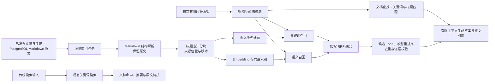

# RAG 接入设计

> 状态：右侧面板与后台 RAG 模块已完成接入；WeKnora 的分块、加权融合、嵌入和重排序协议已裁剪合并到博客服务端。日常环境已按用户要求完成 RAG 迁移并启用问答，支持一般交流、文档查找和多轮聊天。独立测试库与日常入口的定向测试已通过，公开题集效果尚未验证。更新日期：2026-09-29。本文的默认数值是实验起点，不代表效果指标；完整意图识别、独立问题改写和 token 预算仍待实现。

## 1. 目标与现状

目标是让读者用自然语言查询站内**已发布**的文章和手记，并获得能回到原文位置的引用。问候、一般交流可以自然回应，站内事实必须来自当前有效来源。首期索引只处理本站内容；未来若接入 PDF、Word 等资料，应先转换为可检查的 Markdown 与资源清单，再进入同一索引链路。

当前项目中，文章和手记共用 `moment`：`content` 是 PostgreSQL 中的 Markdown 原文，`ext_info.contentKind` 区分 `article` 与 `note`。前端按 Markdown 渲染；后台提供 `.md` 导出，其中结构化导出为 `content.md` 加 `meta.json`，扁平导出使用项目自定义的 `---meta` / `---content` 格式。导出包含未发布内容，因此**在线 RAG 不直接扫描导出目录**。数据库是唯一内容来源，`.md` 是可移植的导出物。历史 `unclassified` 内容需要先确认归属，不能默默当作文章或手记索引。

现有站内搜索使用 PostgreSQL `to_tsvector('simple')`、`plainto_tsquery('simple')` 和 `ILIKE`，并过滤未发布或删除的记录；它不是 BM25，也不是向量检索。当前部署是 `postgres:17-alpine`，不能假设已经安装 `pgvector`。本次新增独立 embedding 适配器，未修改普通搜索。

## 2. 总体链路



当前实现复用现有 Go 服务与 PostgreSQL，将归一化向量保存在 `DOUBLE PRECISION[]`，以点积执行精确余弦检索，不需要安装扩展或部署独立 WeKnora 服务。查询需要扫描当前索引，语料增大后的延迟尚未测量；只有实测需要优化时才评估 `pgvector` 和 HNSW，并对比召回差异。[pgvector 官方文档](https://github.com/pgvector/pgvector/blob/master/README.md)作为后续优化依据。

### 搜索与提问双入口

传统搜索和 RAG 提问是两个独立能力。搜索负责“找到哪些文章或手记”，提问负责“根据已检索证据组织回答”；不能因为接入 RAG 就把普通搜索改成每次输入都调用模型，也不能把普通搜索结果伪装成生成答案。

| 入口 | 触发方式 | 返回内容 | 模型依赖 |
| --- | --- | --- | --- |
| 传统搜索 | 保留现有搜索框、上下文搜索和回车／输入防抖 | 文章或手记命中、摘要片段、内容类型、日期和原文链接 | 无，搜索服务不可用时按现有错误状态处理 |
| 提问 | 用户明确进入“提问”入口并提交问题 | 回答、引用列表、证据片段、原文定位、回答状态和索引版本 | 需要检索、可选重排和生成模型 |

当前采用两个视觉和行为都分开的入口：

- **顶部搜索**继续作为普通搜索入口。它属于书架的导航功能，输入后返回文章或手记命中，不展示生成式回答。
- **右侧问答入口**独立放在页面右边缘，点击后展开右侧问答面板；移动端面板占满可用宽度。它不改变现有书架导航，也不进入独立页面。

问答入口使用文字和对话图标表达，不与搜索或“翻开此页”混用。面板沿用现有字体、颜色和纸张风格；打开时聚焦问题输入框，关闭时焦点返回入口，支持 Escape 和键盘操作。

| 场景 | 顶部搜索 | 桌面问答入口 |
| --- | --- | --- |
| 桌面端默认位置 | 页面上方或现有导航区 | 页面右边缘的独立“问答”入口 |
| 点击后的行为 | 聚焦搜索框或打开搜索模态框 | 从右侧展开面板，保留当前页面作为背景 |
| 提交后的结果 | 文档列表、摘要和原文链接 | 回答、引用、证据片段和“查看原文” |
| 服务不可用时 | 按传统搜索错误状态处理 | 明确显示“问答暂不可用”，提供“改用搜索” |
| 移动端替代 | 顶部搜索按钮 | 页面边缘的问答按钮，展开后适配手机宽度 |

面板不依赖动画才能理解或操作，减少动态效果的系统偏好必须生效。问答面板打开后保留当前页面背景；切换到搜索时关闭问答面板，避免两个弹层重叠。

前端打开面板时查询服务状态，只有服务配置完整且存在当前版本的有效索引才允许发送。输入不触发问答请求；Enter 发送，Shift+Enter 换行，输入法组词期间的 Enter 不发送。用户气泡靠右，助手气泡靠左，完整保留当前页面的历次问答。关闭面板取消未完成请求并标记中止，保留已有记录、草稿与匿名会话 UUID；重新打开仍保留，刷新后清空。服务不可用时显示真实状态、禁用发送，并提供重新检查和站内搜索入口，不展示虚构回答或引用。

提问只在用户提交时触发请求，发布状态与内容类型由服务端校验。当前接口使用项目统一响应封装，接口路径如下；日期过滤尚未实现：

```text
GET  /api/v2/public/search?q=<query>&limit=<n>
GET  /api/v2/public/rag/status
POST /api/v2/public/ask
{
  "question": "...",
  "contentKind": "article",
  "sessionId": "客户端当前页面内存中的 UUID",
  "history": [
    { "role": "user", "content": "上一轮问题" },
    { "role": "assistant", "content": "上一轮回答" }
  ]
}
```

`contentKind` 可选，省略时同时检索公开文章和手记；仅接受 `article` 或 `note`。`sessionId` 可选，省略时服务端生成单次会话 UUID；侧边栏会在同一页面使用稳定 UUID。`history` 可选，最多为最近五轮成功回答、十条交替的 user／assistant 消息；单条问题最多 1000 字符，回答最多 6000 字符，历史合计最多 20000 个 Unicode 字符，保留完整问答对。服务端校验角色、顺序与长度，不接受 system 角色。页面展示记录与模型上下文窗口分别管理：页面记录全部保留，模型只接收预算内的近期历史。当前不写数据库、localStorage 或服务端会话存储。

RAG 失败时必须返回明确状态，并提供“改用搜索”的动作；不能把普通搜索命中伪装成生成答案。站内事实问题没有足够证据时显示“站内现有内容未找到依据”，同时可给出相关搜索入口；问候与一般交流不因此拒答。超时、模型不可用和索引暂不可用分别记录，便于区分内容问题与基础设施问题。

### 索引同步与边界

1. 数据库触发器在来源事务内持久化索引任务；工作进程使用租约领取，每个来源最多尝试五次，并每分钟对账。取消发布或删除时在同一事务内排除来源并清理派生块，不依赖进程内事件。每批最多 16 块，发送 embedding 请求前用一次来源状态查询检查发布状态、指纹和租约；这项循环内 SQL 用于停止撤回后的后续发送，不逐块查询。
2. 发布后读取数据库当前版本，解析并构建新块，完成后原子切换可检索版本。旧任务落后于新内容时丢弃其结果。取消发布或删除时立即使旧索引不可检索，再异步清理派生数据。
3. 查询时再次校验来源仍为已发布且未删除；即使索引同步延迟，也不得把草稿、已撤回内容或旧版本片段交给生成模型。
4. 来源指纹覆盖原文、标题、摘要、类型和短链接；原文中的资源引用变化也改变指纹。索引配置指纹覆盖分块器版本、分块参数、embedding 地址、模型、维度和手动版本，不包含密钥。当前逐篇原子替换旧块，更换配置后只查询新版本已就绪的文档；尚未实现全站并行索引、版本快照与回滚。
5. 首次上线做一次受控全量回填，以后增量更新；导出的结构化和扁平 `.md` 不得同时回灌，以免一篇内容被索引两次。

当前证据包含来源 ID、类型、来源指纹、块 ID、块类型、标题路径、原文偏移、页面 URL、索引版本与实时日期。字符偏移按 Unicode 码点计数，`start` 包含起点、`end` 不包含终点。标题路径与重复表头放在 `contextHeader`，`content` 保持原文。URL 由服务端根据现有阅读页路由生成；尚不支持段落锚点、相邻块或图片资源映射。

## 3. Markdown、表格与多模态处理

当前用 Goldmark 识别真实 Markdown 标题，结合递归分隔与保护区域处理代码围栏、GFM 表格、链接、图片替代文字和 `$$` 公式。原文不被清洗或改写，大段代码与表格只在完整行之间拆分，过长的单行或公式记录为索引失败。以下表格为后续完整内容处理要求；HTML／自定义组件规范化、OCR、图片识别、PDF／Word 转换尚未实现。不能把原文保留等同于理解图片或公式。

| 内容 | 索引表示 | 引用与质量要求 |
| --- | --- | --- |
| 普通正文 | 原文段落加文章标题、标题路径；保留列表层级与链接文字 | 回到原文标题或段落，避免只给文章首页 |
| Markdown / HTML 表格 | 表名、邻近说明、列名和若干完整数据行组成一个表格块；大表按行组拆分，每块重复列名和单位 | 保留行列标识与原始数值；跨行／跨列 HTML 表格先规范化并人工抽样校验，不能用无结构的单行文本代替 |
| 普通图片、相册图片 | 作者填写的替代文字、图注和相邻正文优先；必要时另建图片说明块，并与父段落关联 | 说明模型生成的描述只能标记为机器推断；没有图片或无有效说明时不编造图像内容 |
| 文档中的截图、含字图片 | OCR 文本作为独立资源块，带图片 ID、所属段落、识别置信度；去除重复水印、页眉页脚 | 代码、数字、按钮文字和截图表格须抽样复核；低置信度内容不作为唯一证据。若问题依赖布局或颜色，后续需视觉模型核验，OCR 本身不够 |
| 公式 | 原始 LaTeX／Unicode 表达式作为不可拆分单元；可另存经审核的文字解释 | 精确符号、变量与上下文同时引用；图片公式需要专门识别和人工复核，不能把 OCR 猜测当原式 |
| 代码块 | 保留语言、完整代码块与邻近解释；超长代码按语义段落拆分 | 标识符、版本号和报错文本需要关键词通道，不能只依赖语义向量 |
| HTML 与自定义组件 | 解析可见文本及有意义属性；排除脚本、样式、装饰性内容 | 无法可靠还原的组件先记录为不可索引，不静默丢失关键信息 |
| 未来 PDF / Word | 原文件先转为规范 Markdown、资源清单及页码／区域映射，再执行上述步骤 | 保留原文件与页码来源，检查阅读顺序、合并单元格、图表和公式；转换为 `.md` 不能自动消除版式解析错误 |

图片资源以文件内容哈希去重；OCR 与图片说明分开存放，标明生成工具、版本和置信度。只处理本站上传或明确允许抓取的资源，外链下载须限制域名、大小和超时。文中图片被删除、替换或取消发布时，同步清理对应资源块。封面图默认不当作正文证据，除非作者确实为它提供了与内容相关的说明。

## 4. 分块方案：首轮参数

当前实现按 **Unicode 字符**计数，默认 `1200` 字符、同章节完整单元重叠上限 `120` 字符；保护块最多允许 `2400` 字符。标题路径和表头另行加入模型输入。下表是未来按 **embedding tokenizer** 测量后的调参方向，目前没有 tokenizer 测量结果，不把字符数当作 token 数。

| 类型 | 首轮切法 | 重叠 |
| --- | --- | --- |
| 短手记 | 含标题路径后不超过约 500 token 时整篇一块 | 0 |
| 长文章 | 先按 Markdown 标题，再按段落和句子；目标 350–500 token，普通文本块上限 700 token | 仅同一章节内被迫拆分时保留约 50 token，优先对齐句界 |
| 表格 | 小表完整保留；大表按 200–400 token 的连续行组拆分，每块重复表名、列名和单位 | 行不重复，表头作为上下文重复 |
| 图片说明 / OCR | 每张图作为关联资源；较长 OCR 按区域或段落切成约 200–400 token | 通常 0；不跨图片拼接 |
| 公式 / 代码 | 优先保留原子结构；超模型上限时按公式组、函数或代码段拆分，并关联父块 | 不从公式、字符串或代码围栏内部截断 |

当前 embedding 输入由 `contextHeader` 和原文 `content` 组成；日期在生成时提供。重叠不跨章节，不合并不同文档。无法安全拆分的过长原子块标记 `oversized_atomic_block`，不截断后继续入库。首轮不启用父子分块，只有出现稳定缺少上下文的问题时再评估。

配置大小是分块目标与普通文本上限，实际块长随标题、段落及保护区域变化，并非每块固定 1200 字符。当前没有按内容类型分别配置大小或按 tokenizer 计算预算。下一步调参应保持同一内容快照和标注问题集，先比较 600／1200／1800 字符，再对胜出配置比较 0／10%／20% 的同章节重叠；这些是待测组合，不能标作最优参数。代码、表格和短手记分别检查结构完整性，不用增加重叠掩盖切断结构的问题。

分块验收先看原文覆盖、空洞、重复比例、长度分布与引用定位，再看检索效果。两份参考项目都强调结构边界、预览和回归；[MimirQ 分块手册](https://github.com/skygazer42/MimirQ/blob/main/docs/guides/chunking_playbook.md)、[WeKnora 分块文档](https://github.com/Tencent/WeKnora/blob/main/website-docs/03-features/04-chunking.md)的默认字符值不能直接照搬到本站的 token 配置。

## 5. 检索、TopK、RRF 与重排

这里把“召回候选数”和“最终交给生成模型的证据数”分开配置。先运行关键词基线，再增加语义通道；每次只引入能通过评测证明收益的复杂度。

| 决策 | 首轮方案 | 何时调整 |
| --- | --- | --- |
| 关键词检索 | 当前对块原文、标题和路径做子串匹配；保留英文标识符与中文相邻双字，标题／路径命中加权。不是 BM25，未复用普通搜索结果作为生成答案 | 在真实题集上比较中文、专名、日期和数字召回后再调整分词或索引 |
| 语义检索 | 选择能处理中文和中英混排的 embedding 模型；同一索引版本只用一个固定维度；先精确检索 | 语义改写、近义表达的召回收益不明显时调整模型或分块；延迟瓶颈才评估 HNSW |
| 候选 TopK | 每路默认 20，后台分别配置 `vectorTopK` 与 `keywordTopK`，范围 1–100；RRF 后默认保留 40 个候选 | 召回不足时先查解析、索引和过滤；再比较不同深度的收益与延迟 |
| RRF 融合 | 默认 `k=60`、向量权重 `0.7`、关键词权重 `0.3`，复用 WeKnora 加权公式；按块 ID 去重，支持关闭单路权重 | 后台校验两路非负权重合计为 1；权重变化不触发索引重建 |
| 最终证据 TopK | 后台配置 1–20，默认最多 6 块；重排序后每篇最多 2 块，排除原文范围重叠至少一半的片段 | 尚无 tokenizer 预算或相邻块合并；通过实际评测调整 |
| 动态 TopK | 不启用自动动态 TopK，使用后台显式配置 | 只有实测复杂问题证据不足时才评估第二次检索 |
| 模型重排序 | 已接入 `/rerank`，默认开启，分数下限 `0.2`；候选数、阈值和失败回退均可配置 | 返回结果逐项校验索引、唯一性及有限分数；失败回退到 RRF 并记录降级，或按配置暂停回答 |

RRF 是**名次融合**，不是 rerank 模型：`score(d) = vectorWeight / (K + vectorRank(d)) + keywordWeight / (K + keywordRank(d))`，名次从 1 开始，没有命中的通道不计分。它避免混合不可比的原始分数；默认值需要实际评测，不代表本站最优值。[RRF 原始论文](https://research.google/pubs/reciprocal-rank-fusion-outperforms-condorcet-and-individual-rank-learning-methods/)与 [pgvector 的混合检索说明](https://github.com/pgvector/pgvector/blob/master/README.md#hybrid-search)可作为实现依据。Cross-encoder 对“问题、候选块”逐对评分，不能找回初始召回中不存在的证据；见 [Sentence Transformers 官方说明](https://www.sbert.net/examples/cross_encoder/applications/README.html)。

查询前先限定公开范围与内容类型，时间问题尽量利用日期元数据；命中后再复核实时发布状态。标题、准确名称、代码、公式和数字问题应保留关键词通道。融合后按同篇／同章节去重，避免 6 个名额被同一段的大量重叠块占满。站内事实没有足够证据时明确说明，不拿低相关块凑答案；生成失败时提供普通站内搜索入口。

“有 Go 相关的内容吗”等文档查找问题，先提取主题并走现有关键词召回，标题按大小写不敏感匹配，英文名称遵守词边界，同篇只保留一个来源。已找到的有效标题足以证明文档存在，不要求正文同时回答技术问题，也不经过正文重排序阈值。精确标题命中无需问题 embedding；没有标题命中时仍执行混合检索。查找结果正常给出原始标题与引用，不增加文档用途说明。这条路径仍复核公开状态、版本和指纹，不改变普通搜索接口。

融合和重排应分阶段比较关键词、向量、RRF、RRF 加重排的结果：先看候选召回，再看最终证据排序、引用正确性、拒答、延迟和调用成本。重排无法补回未召回的文档，阈值也不是通用置信度。当前后台保存的是可调起点，尚无公开题集证明默认权重、候选数、阈值和最终 TopK 最优。

## 6. 回答、引用与接口约定

传统搜索接口继续返回文档命中，不新增生成式字段作为搜索结果的必要条件。现有 `GET /public/search` 的查询参数和排序应保持兼容；若未来增加内容类型或日期过滤，应以可选参数扩展，并继续过滤未发布和已删除记录。

当前 `POST /api/v2/public/ask` 返回回答状态、模式、正文、引用和索引版本。`mode=conversation` 用于一般交流，没有引用；`mode=grounded` 用于有据的站内回答，引用包含原文标题、URL、路径、片段、字符偏移和日期。生成模型仅返回证据编号，服务端校验编号、正文标记与引用列表一致，再映射到真实来源。生成前后复核公开状态、来源指纹和日期。当前链接进入阅读页，原文片段可在面板展开查看；段落定位与 OCR 来源仍待实现。

提问结果应使用可区分的状态，而不是用空字符串猜测失败原因：

| 状态 | 含义 | 前端动作 |
| --- | --- | --- |
| `answered` | 自然交流，或证据通过校验的站内回答 | 显示回答；有引用时显示原文来源 |
| `no_evidence` | 站内事实问题未找到足够依据 | 说明依据不足，并提供“改用搜索” |
| `temporarily_unavailable` | 索引、模型或服务暂时不可用 | 显示重试和传统搜索入口 |
| `invalid_scope` | 请求范围不允许或参数无效 | 提示调整范围，不调用生成模型 |

生成模型只接收通过权限检查的证据。提示词将问题、历史和正文均视为数据，忽略其中要求改变角色、泄露信息或执行操作的指令。历史回答只用于连续交流和指代理解，不能充当已核实的站内证据。对数值计算、排序或汇总问题，优先使用可验证的结构化数据和程序计算；若只有自然语言段落，则展示原文数值和计算依据。保留站内事实“无法回答”的路径，不允许无证据时补写站内事实。

### 意图与问题改写的实现边界

当前通过有限的文档查找表达式提取主题，并由回答提示词区分一般交流与有据回答。其他有历史的问题只把上一轮问题附到检索输入，尚未迁入 WeKnora 的完整 `query_understand` 阶段，不能称为独立问题改写。一般交流仍可能执行检索，嵌入故障会影响它；这项依赖尚未解除。

后续应在检索前输出受校验的 `intent`、`query` 和 `needsClarification`：问候／一般交流直接生成，文档查找走文档召回，站内事实走混合检索，含指代的追问先改写成独立问题再选择路径。例如上一轮查找 Go 文章，下一轮“它的目录怎么分工？”应补全文章名称；换成 Java 问题时不能继续拼接 Go。保留原问题用于回答，只让改写问题参与召回，不增添用户没有表达的实体或事实。明显意图走规则，歧义问题再用结构化模型判断；改写失败保留原问题，不阻断可直接理解的问题。

当前模型窗口固定最多五轮且按字符预算截取。后续应按模型 token 预算分别分配历史、证据与回答，优先保留相关近期完整问答对，再评估旧对话摘要；长期记忆、摘要与刷新后保存均未实现，不默认把完整历史存入数据库。

## 7. 评测与上线门槛

先建立本站自己的可审查题集，记录问题、期望答案、正确文章／手记、原文位置和允许的等价答案。至少覆盖：短手记、长文章、跨段问题、日期、中文专名、表格行列、图片文字、截图、公式、已撤回内容、无答案问题。建议从 60–100 道人工标注题起步，按内容形态分层；没有真实样本的模态不宣称已支持。新参数与模型须在同一题集、同一索引快照和相近运行条件下对比。

| 层次 | 指标与检查 | 用途 |
| --- | --- | --- |
| 解析和分块 | 可索引原文覆盖率、漏段、重复率、表头与公式完整性、图片和 OCR 的来源映射 | 先确认数据进入索引时没有失真 |
| 检索 | `Recall@20`、`MRR@10` 或 `nDCG@10`、最终证据命中率；按文本／表格／图片／公式分别统计 | 比较关键词、向量、RRF、rerank、不同分块参数 |
| 回答 | 引用准确率、答案有据率、无答案拒答正确率、数字和表格答案正确率 | 不用“回答看起来流畅”代替证据检查 |
| 系统 | 索引滞后、任务失败率、查询 P95 延迟、模型调用量与成本、已撤回内容泄漏数 | 判断是否可以公开使用 |

项目内容题集属于**定向测试**；上线前用少量真实链路问题做**冒烟测试**。若将来使用公开、可追溯的数据集，才另列为**公开权威数据测试**，不得把本站定向题分数混称公开基准。脚本必须从项目问答入口调用完整链路，不能在脚本中直接替代分块、检索或生成逻辑。发布前硬约束是草稿／撤回内容零泄漏、引用能打开且能对应证据；其余效果阈值先测基线，再按成本与体验确定，不预填未经测量的达标数字。

传统搜索和提问分别验收：搜索至少记录命中率、原文打开率、摘要相关性和 P95 延迟；提问再记录证据命中率、引用准确率、无答案拒答正确率、生成延迟和成本。两类指标不合并成一个“搜索效果”分数，避免模型不可用时掩盖传统搜索回归。

## 8. 实施顺序与运维

1. **准备**：抽样清点 Markdown、表格、图片、截图、公式和自定义组件；确认 `unclassified` 处理规则；建立分块预览与标注题集。
2. **搜索契约**：保留现有传统搜索入口和结果形态，补齐内容类型／日期等可选过滤；先确保搜索不依赖模型，记录搜索基线指标。
3. **文本基线**：补持久化索引任务、公开范围校验和标题感知分块；先完成关键词召回与证据定位，再实现独立的提问接口。
4. **提问入口**：在后端问答链路、引用和失败状态可用后，再上线独立“提问”入口；生成服务不可用时回退到传统搜索入口，不把两者混成一个结果。
5. **语义与融合**：先验证当前 PostgreSQL 数组精确检索与 RRF，比较关键词、向量、融合的真实题集结果；向量扩展与并行全站索引作为后续优化。
6. **扩展内容形态**：优先把现有 Markdown 表格和图片替代文字索引可靠；再接入 OCR、截图表格、视觉核验和公式识别。每扩展一种模态，都增加对应定向题与人工抽样。
7. **按证据优化**：对比当前 rerank 与 RRF 基线，依据增益、延迟和成本调参；仅在复杂问题证据不足时试动态 TopK、父子块或有限的相邻块扩展。

运维上分别监控解析、分块、embedding、检索、重排和生成耗时；日志记录来源 ID、版本和错误类别，避免写入完整私人内容、凭据或不必要的原始提问。模型密钥只在服务端配置；外部 embedding、OCR 或视觉服务的内容出境范围需在启用前明确。索引是可重建的派生数据，备份以原始 PostgreSQL 内容和图片资源为先，同时保留索引版本与重建记录。服务降级时返回已有搜索结果或明确错误，不用过期索引生成看似可信的答案。

## 9. WeKnora 接入方向与参考项目边界

已按用户选择将 `C:\Document\Desktop\GitHub\RAG\WeKnora` 的相关代码裁剪合并到博客，而非调用独立 WeKnora 服务。参考版本为 `a46a3c5996785fd7d3713a650e21d02ed7517710`；保留了[MIT 许可证及来源路径](server/licenses/WeKnora-MIT.txt)。新增 Go 代码复用现有依赖，没有引入 WeKnora 的租户、知识库管理或完整 Agent 平台。

问答、向量和重排序模型统一使用服务端 `.env`，模板见 [Config/rag.env.example](Config/rag.env.example)。主通道为 OpenCode Go `deepseek-v4.1-flash`，兜底为 DeepSeek 官方 `deepseek-flash`，均走 OpenAI 兼容 Chat Completions。主通道配置无效时跳过；超时、HTTP 错误、空结果或引用校验失败时尝试兜底。正确返回无依据时不调用兜底；每次调用聊天通道前复核公开证据。每个聊天通道最多尝试一次、超时最多 30 秒，问答整体 90 秒，其中问题 embedding 最多 15 秒，重排序默认最多 10 秒。

Go 请求使用自身 `User-Agent: grtblog-rag/1.0` 与当前会话 UUID 的 `x-opencode-session`，不冒用参考项目身份。已查阅本机 `deepseek-harness` 的请求头合并、应用身份和 pi-ai 会话传递实现，并以 [Go 官方要求](https://opencode.ai/docs/go/#where-can-i-use-it)补齐会话头。用户已明确要求启用日常问答并以 OpenCode Go 为主，日常 `RAG_ENABLED=true`，主通道实际请求已验证；独立定向测试另验证了官方 DeepSeek 真实兜底。两条聊天通道的密钥由用户在本地配置，不能写入文档或模板。一次本机请求成功不等同于长期服务可用性或供应商用途保证。

向量服务模型列表已通过用户授权的 `GET /v1/models` 查询，选用列表中的 `BAAI/bge-m3`。其[官方模型卡](https://huggingface.co/BAAI/bge-m3)说明原生输出为 1024 维并支持多语言；作为中文与中英混排基线，不宣称是本站最佳模型。`RAG_EMBEDDING_DIMENSIONS` 留空，不向不支持缩维的模型发送 `dimensions`。查询与索引维度不一致时拒绝回答，变更模型或版本后重建索引。

重排序基线选择同一真实模型列表中的 `Pro/BAAI/bge-reranker-v2-m3`，使用 WeKnora 的远程请求结构以及 [SiliconFlow `/rerank` 协议](https://siliconflow.readme.io/reference/creatererank)。请求带 `model/query/documents/top_n/return_documents`，不设置可能截掉问题的 `truncate_prompt_tokens`。该路由已通过合成文档的真实推理，分数分布与阈值效果尚未经过公开题集评测；后台可更换阈值、关闭重排序或禁止失败回退。重排序参数不改变已存储的向量，也不阻塞独立入库任务。

| 配置 | 含义 |
| --- | --- |
| `RAG_ENABLED` | 服务开关，默认关闭；关闭时不启动索引查询与模型调用 |
| `RAG_CHAT_PRIMARY_*` | 主通道的 `BASE_URL`、`MODEL`、`API_KEY`、`HEADERS_JSON`、`EXTRA_BODY_JSON`、`SESSION_HEADER`、`TIMEOUT` |
| `RAG_CHAT_FALLBACK_*` | 兜底通道的地址、模型、密钥、自定义请求头、额外请求体和超时；Go 会话头不带到官方 DeepSeek |
| `RAG_EMBEDDING_*` | 向量服务 `BASE_URL`、`MODEL`、`API_KEY`、可选 `DIMENSIONS` |
| `RAG_RERANK_*` | 重排序服务 `BASE_URL`、`MODEL`、`API_KEY`、`TIMEOUT`；超时范围大于 0 且不超过 15 秒 |

聊天地址填写实际 API 根路径，例如 Go 地址以 `/v1` 结尾，DeepSeek 官方地址为 `https://api.deepseek.com`；代码追加 `/chat/completions`。JSON 配置在 `.env` 中作为一行对象填写，`EXTRA_BODY_JSON` 不能覆盖模型、消息或流式开关。模板为选定的 DeepSeek 模型关闭 thinking；更换供应商时按其协议调整，不默认向所有 OpenAI 兼容模型发送此扩展字段。`.env` 由现有启动入口加载，修改后需要重启服务。实际密钥不进入 Git、返回体或错误日志。

后台新增独立 `/rag` 菜单，包含三个页签。密钥及供应商地址不在后台返回，模型“已配置”表示本地参数完整，不表示供应商连接已通过。

页面复用既有组件与数据流：前台使用 `Button`、`Textarea`、bits-ui `Dialog`、`QueryRoot` 和共享 API 客户端；`Textarea` 仅补充原生属性透传及元素引用，保持原有调用兼容。后台使用 `PageHeader`、`ScrollContainer`、Naive UI 的表格／表单／抽屉／分页及既有请求封装，数据请求沿用 TanStack Query。新增页面组件只组合 RAG 业务，没有新增基础组件库或依赖。

- **索引文档**：标题与类型筛选、索引状态、当前有效块数、尝试次数、最近成功索引时间／耗时、失败原因；分页查看当前公开分块，单篇重建／重试及全量重建。源内容已撤回或版本过期时，不返回旧分块正文。
- **检索配置**：分块大小／重叠、手动版本、两路召回 TopK、最终 TopK、向量阈值、RRF K 与权重、融合候选数、重排序开关／阈值／失败回退。所有组合参数由服务端校验后，通过既有系统配置服务批量保存。改变分块或嵌入指纹后自动增量重建；仅改变召回、融合或重排序参数不重建。
- **运行指标**：近七个 UTC 日的合法问答请求数、回答／依据不足／不可用次数、主通道失败、兜底调用、重排序降级与实际阶段平均耗时。只存按日聚合计数与耗时，不存问题、会话、答案或来源正文。限流与格式错误不计入；耗时不含指标写入。阶段未执行时显示 `—`。不展示未经公开数据集评测的准确率、Recall、MRR 或 nDCG。

关闭 RAG 时仍可读取管理配置和索引记录、提交待处理任务，不调用模型。管理接口均使用现有管理员认证：

```text
GET  /api/v2/admin/rag/index       索引状态与实际维度
POST /api/v2/admin/rag/reindex     提交持久化重建任务
POST /api/v2/admin/rag/preview     {"title":"...","markdown":"..."}
GET  /api/v2/admin/rag/settings    非敏感配置与模型配置状态
PUT  /api/v2/admin/rag/settings    完整检索参数对象
GET  /api/v2/admin/rag/documents   page/pageSize/search/status/contentKind
GET  /api/v2/admin/rag/documents/:id/chunks  page/pageSize
POST /api/v2/admin/rag/documents/:id/reindex
GET  /api/v2/admin/rag/metrics     近七个 UTC 日的运行聚合
```

分块预览只读取分块配置，不写入索引、不调用模型；当前输出原文、标题路径、类型及码点偏移，不包含 token 估算或覆盖率评分。

迁移 `0076_add_rag_index.sql` 与 `0077_add_rag_management.sql` 已经项目 Goose 入口在独立 PostgreSQL 17 测试库执行，并在用户明确批准后应用到日常数据库：前者新增派生索引表、触发器、指纹函数和四个配置项；后者补充成功索引元数据、按日运行聚合表及十个检索配置项。日常八篇公开文档已生成四十个有效分块。核心 `moment` 内容不被修改，派生块外键使用 `ON DELETE RESTRICT`。运行聚合独立于来源生命周期，不级联删除，也不自动清理历史；回滚 `0077` 会移除这张 RAG 运行聚合表，回滚过程尚未验证。

`C:\Document\Desktop\GitHub\RAG` 下的两个项目可以作为实现参考和部分组件来源，但不应把它们的知识库、租户、文档上传和 Agent 平台整套搬进本站。本站的核心数据仍是 `moment` 中的已发布 Markdown，现有普通搜索和文章／手记 URL 也应保持不变。

| 参考项目 | 可以优先复用 | 需要按本站重写或裁剪 |
| --- | --- | --- |
| `MimirQ` | `docs/guides/chunking_playbook.md` 的分块预览、coverage／gap／overlap 检查；`retrieval_fusion.md` 的多通道融合、RRF 和 budgeted RRF 思路；`evidence_api.md` 的检索与生成解耦、版本化 evidence schema、retrieval trace；多模态证据排障方法 | Python 服务、数据集／租户模型、Milvus 等基础设施、完整 API 路径和权限体系 |
| `WeKnora` | `docs/CHUNKING.md` 的 `auto`／`heading`／`heuristic`／`legacy` 分层策略、Markdown 标题面包屑、parent-child 的可选配置；`knowledge-search.md` 的“只返回检索结果”契约；向量存储连接测试和 OCR／图片资源分离思路 | 知识库和空间模型、文件上传流程、向量库管理接口、Agent／MCP／多租户能力及其数据库表 |

落到本站时，建议按下面的顺序复用：

1. 先实现一个只读的分块预览，输出标题路径、块类型、字符偏移、token 估算、coverage 和重复检查；它同时服务调参和回归，不写入正式索引。
2. 再把检索层拆成“证据召回”和“回答生成”两段。普通搜索继续走现有 `/public/search`；提问入口内部先得到带来源定位的 evidence，再决定是否交给模型生成。
3. 证据对象沿用稳定字段：`moment_id`、`chunk_id`、`chunk_type`、标题路径、`start_at`／`end_at`、来源 URL、索引版本和检索角色。这样后续可以替换 embedding、向量存储或 rerank，而不改前端引用契约。
4. 首版只接本站需要的关键词＋向量两路；MimirQ 的多路 sparse、知识图谱和 WeKnora 的完整向量存储管理先不引入，等题集证明确有收益再扩展。
5. `rerank` 已作为可配置阶段合并；动态 TopK、parent-child 和图片／表格专用通道仍待真实效果需求再实现。普通搜索继续独立运行。

复用前需要再次核对许可证、依赖版本、数据出境和生产部署限制；参考项目的默认 chunk 数值、模型配置和接口字段不能未经评测直接当作本站的最终配置。

## 10. 查阅依据

- 本项目：[内容模型](server/internal/infra/persistence/model/content.go)、[内容类型](server/internal/domain/content/kind.go)、[发布与删除事件](server/internal/app/moment/events.go)、[现有搜索](server/internal/infra/persistence/search_repository.go)、[导出范围](server/internal/app/contentexport/collect.go)、[导出布局](server/internal/app/contentexport/layout.go)、[Markdown 渲染配置](web/src/lib/shared/markdown/svmarkdown.ts)、[部署配置](deploy/docker-compose.yml)。
- 本机参考项目：[MimirQ](https://github.com/skygazer42/MimirQ) 的 Markdown 规范化、标题分块、[分块手册](https://github.com/skygazer42/MimirQ/blob/main/docs/guides/chunking_playbook.md)与[检索融合](https://github.com/skygazer42/MimirQ/blob/main/docs/guides/retrieval_fusion.md)；[WeKnora](https://github.com/Tencent/WeKnora) 的 Markdown 图片解析与[分块机制](https://github.com/Tencent/WeKnora/blob/main/website-docs/03-features/04-chunking.md)。借鉴其可观察、可回归的做法，不直接移植整套平台。
- 方案依据：[PostgreSQL 17 全文检索文档](https://www.postgresql.org/docs/17/textsearch-controls.html)、[pgvector 官方文档](https://github.com/pgvector/pgvector/blob/master/README.md)、[RRF 原始论文](https://research.google/pubs/reciprocal-rank-fusion-outperforms-condorcet-and-individual-rank-learning-methods/)、[Cross-encoder 官方说明](https://www.sbert.net/examples/cross_encoder/applications/README.html)。
- 模型与协议：[OpenCode Go](https://opencode.ai/docs/go/)、[DeepSeek 官方调用文档](https://api-docs.deepseek.com/guides/harness)、[BGE-M3 模型卡](https://huggingface.co/BAAI/bge-m3)、[重排序 API](https://siliconflow.readme.io/reference/creatererank)。

## 11. 当前交付与验证记录

| 范围 | 修改或新增文件 |
| --- | --- |
| 环境配置 | `server/internal/config/config.go`、`server/internal/config/rag.go`、`Config/rag.env.example`；本机忽略文件 `server/.env` |
| 业务与实体 | `server/internal/app/rag/{admin,settings,service,tuning,worker}.go`、`server/internal/domain/rag/{admin,entity,repository}.go` |
| 模型与分块 | `server/internal/infra/ai/{embedding,rag_chat,rerank}.go`、`server/internal/infra/rag/{chunker,fusion}.go` |
| 持久化与入口 | `server/internal/infra/persistence/{rag_repository,rag_admin_repository}.go`、`server/internal/http/handler/rag_handler.go`、`server/internal/http/router/{rag_routes,router}.go`、`server/internal/server/server.go` |
| 迁移与许可证 | `server/migrations/{0076_add_rag_index,0077_add_rag_management}.sql`、`server/licenses/WeKnora-MIT.txt` |
| 前端 | `web/src/lib/features/rag/{api,types,conversation}.ts`、`web/src/lib/features/rag/components/{RagSidebar,RagChatClient,RagTranscript}.svelte`、`web/src/lib/ui/primitives/textarea/Textarea.svelte`、`web/src/routes/+layout.svelte`、`web/src/routes/layout.css` |
| 后台 | `admin/src/services/rag.ts`、`admin/src/router/record.ts`、`admin/src/views/rag/{index,IndexDocuments,DocumentDrawer,SettingsPanel,MetricsPanel}.vue`、`admin/src/views/rag/format.ts` |
| 定向验证 | `Test/{rag-sidebar,rag-integration,rag-degradation,rag-chat,rag-discovery}.mjs`、`Test/start-rag-test.ps1`、`Test/rag-{integration,degradation}_result_20260928.json`、`Test/rag-{chat,discovery}-results_20260928.json`、`Image/figures/rag-*.png` |
| 文档 | `RAG.md`、`TODO.md`、`web/AGENTS.md` |

2026-09-28 的静态检查：Go 构建与相关包 `go vet` 通过；新增后台的 Vue 类型检查、ESLint、Prettier 和生产构建通过。构建保留现有 `advancedChunks` 废弃、`VITE_APP_NAME` 未配置及较大分包告警，本次未修改这些配置。已有侧边栏的 Svelte 类型检查为零错误，保留现有 `ThemeIcon.svelte` 非响应变量警告。环境配置已通过项目所用 `godotenv` 的解析及 JSON 格式检查，确认重排序密钥引用可展开，未输出密钥。未运行全量测试。

**定向测试**从真实前端首页进入，经本机 Edge 验证桌面 `1440×900` 与移动 `390×844` 的不可用状态：焦点圈定、Escape 与焦点恢复、草稿保留／清空、重新检查、搜索切换、发送禁用、零问答请求及无横向溢出，并检查截图。脚本不替换接口、不模拟模型或核心模块。

经用户授权，另建 PostgreSQL 17 与 Redis 测试容器，通过完整迁移建立空库，再启动项目 API 入口。合成文章、手记和草稿均由真实内容接口写入；管理员通过注册／登录接口与页面登录，测试不直接注入业务表、不替换核心模块或伪造接口数据。两篇公开文档产生六个有效分块，向量实际为 1024 维，草稿没有分块。联调发现的分块详情与运行指标 ORM 解析问题已修复，并经接口和页面重新验证。

最终[主链路定向测试记录](Test/rag-integration_result_20260928.json)包含十项检查：认证与非敏感配置、组合参数校验／保存、原文分块偏移、公开入库与草稿排除、真实混合检索和重排序、官方兜底、无依据拒答、关键词权重与最终 TopK、单篇重建／撤回／重新发布、前后台桌面及移动端交互。原始检查数为 10，排除 0，外部失败 0，核心返回 10；这些是合成场景的检查数量，不是问答准确率。调试过程中曾出现一次 `embedding_unavailable`，项目自动重试后恢复，未将该轮失败混入最终完整执行结果。

[降级定向测试记录](Test/rag-degradation_result_20260928.json)另有两项检查：以本机关闭端口制造真实主通道与重排序连接失败，允许回退时经 RRF 和官方兜底回答，禁止重排序回退时停止生成。原始检查数 2，排除 0，外部失败 0，核心返回 2；预期故障属于这组测试的输入条件。没有使用模型桩或重写检索逻辑。

前后台页面截图见 `Image/figures/rag-admin-*_20260928.png`、`rag-answer-*_20260928.png` 和 `rag-integration-*_20260928.png`，均由本机 Edge 通过项目真实入口生成并检查。测试入口脚本为 `Test/rag-integration.mjs` 与 `Test/rag-degradation.mjs`；后者需要用 `Test/start-rag-test.ps1 -RerankUnavailable` 启动独立测试配置。启动脚本读取由项目 `godotenv` 传入的环境，在子进程中覆盖独立数据库和测试端口，不修改日常 `.env`；日志与可执行文件只放入 `Temp/`。两组测试均要求空的独立测试库，不能对日常数据库运行。

2026-09-28 至 2026-09-29 的[聊天定向测试](Test/rag-chat-results_20260928.json)从实际首页经本机 Edge 操作：六个接口样本全部通过，排除零、外部失败零；另验证 Enter 发送、Shift+Enter 换行、三轮追问与关闭重开保留、左右气泡以及桌面／移动端布局。截图为 `Image/figures/rag-chat-{desktop,mobile}_20260928.png`，已检查实际渲染。

[文档查找定向测试](Test/rag-discovery-results_20260928.json)从同一个前端代理入口提问 Go、Java、Python：三个有效样本中，Go、Java 返回各自文章引用，话题切换没有混入上一轮来源；缺失的 Python 文档返回依据不足。最终完整运行原始数三、排除零、外部失败零、核心通过三。此前一次排查运行因嵌入服务不可用被阻断，未作为功能通过记录；修复后精确标题查找不再依赖问题 embedding。验证不要求额外标注文档用途。

尚未验证迁移回滚、大规模语料延迟与公开权威题集效果；没有检索／问答准确率或召回率分数。定向功能验证不能代表知识库效果，分块与阈值仍需按真实题集调整。结构化意图分类、独立问题改写、内容类型分块参数、token 预算及持久化对话仍未实现。改动按功能分组提交，未推送 Git。
